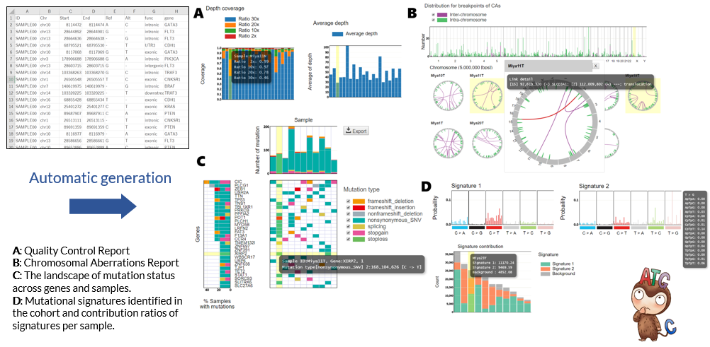

************************
Introduction
************************

| Paplot is graph generator from analysis results of genome.
|
| For example, you have such a text file by analyzing the genome.
|

| What do you want to after this?
| Do you want to create a graph?
| Do you create charts manually each time?
| Do you write scripts such as wrote previously?
| Do you create a graph in time to change the extraction conditions and sort conditions of the data?
|
| Paplot will automate these tasks.
|

Graphs can be created
--------------------------

1. QC (Quality Control) graph

| QC graph reports each bam's quality.
|

.. image:: image/qc_dummy.PNG
  :scale: 100%

2. CA (Chromosomal Aberration) graph

| Circos like plot views inter chromosomal aberration, for example Structural Variation (SV).
| Bar plot views these distribution.
|

.. image:: image/sv_dummy.PNG
  :scale: 100%

3. mutation-matrix graph

| This matrix graph plots mutation number.
| Virtical axis is gene and Horizontal axis is sample.
|

.. image:: image/mut_dummy.PNG
  :scale: 100%

4. signature |new|

| This reports views each signature of detected mutation.
| Stacked graph views aggregation of signature.
|

.. image:: image/sig_dummy.PNG
  :scale: 100%

`You can use also pmsignature <https://github.com/friend1ws/pmsignature/>`_ .

.. image:: image/pmsig_dummy.PNG
  :scale: 100%

.. |new| image:: image/tab_001.gif
