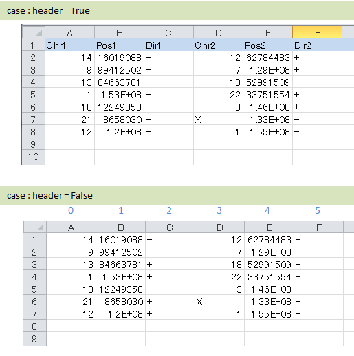

**************************
Use own data
**************************

To use the data other than Genomon will specify your file format by editing the config file.

A sample configuration file is located in the following.

``{installed directory of paplot}/example/example.cfg``

We prepare config files of each version Genomon. So if you use the Genomon analyzed data, please refer to the :doc:`genomon`.

.. warning::
  
  | Required fields are shown in the highlights. Please set correctly.
  | For information on how to specify the sample names, please also see :ref:`suffix and ID<suffix>` 

Please use this config file with ``--config_file`` option of ``paplot`` command.

Example of execution

.. code-block:: bash

  pa_plot qc "example/qc/*.csv" ./tmp DUMMY --config_file example/example.cfg

1. General
------------

.. code-block:: cfg
  :linenos:

  ###################### general
  [style]
  # path to layout file of graph
  # ~/tmp/paplot/style/rainbow.js
  path = 
  
  # Text to output in the remarks column of the index.html (HTML tag usable, alphanumeric or numeric characters only)
  remarks = 

.. _conf_qc:

2. QC (Quality Control)
----------------------------

If you do not want to change the output graph, only set [result_format_qc] according to your data.

Explanations of each item in :ref:`Input file format<data_format>`.

For advanced use, see also :doc:`config_qc`.

.. code-block:: cfg
  :linenos:
  :emphasize-lines: 8,10,11,12,24,25,26,27,28,29,30,31,32,33,34,35
  
  ###################### qc
  [qc]
  # (none)
  
  # File format of input file (change here to fit your data)
  # See the lower line "Input file format" for details
  [result_format_qc]
  suffix = .qc.csv
  
  sept = ,
  header = True
  comment = #
  
  ##################
  # Column index (required)
  ##################
  
  # (none)
  
  ##################
  # Column index (option)
  ##################
  
  col_opt_duplicate_reads = duplicate_reads
  col_opt_mapped_reads = mapped_reads
  col_opt_total_reads = total_reads
  col_opt_average_depth = average_depth
  col_opt_mean_insert_size = mean_insert_size
  col_opt_ratio_2x = 2x_rt
  col_opt_ratio_10x = 10x_rt
  col_opt_ratio_20x = 20x_rt
  col_opt_ratio_30x = 30x_rt
  col_opt_read_length_r1 = read_length_r1
  col_opt_read_length_r2 = read_length_r2
  col_opt_id = file_name
  
  # File format of output file
  # See the lower line "Output file format" for details
  [merge_format_qc]
  lack_column_complement = NA
  sept = ,
  
  # Settings of area selection graph (brush)
  [qc_chart_brush]
  title = 
  title_y = 
  stack = {average_depth}
  name_set = average:#E3E5E9
  tooltip_format = 
  
  # Settings of each graph (prepare this section each graph)
  [qc_chart_1]
  title = depth coverage
  title_y = coverage
  stack1 = {ratio_30x}
  stack2 = {ratio_20x-ratio_30x}
  stack3 = {ratio_10x-ratio_20x}
  stack4 = {ratio_2x-ratio_10x}
  name_set = ratio_30x:#2478B4, ratio_20x:#FF7F0E, ratio_10x:#2CA02C, ratio_2x:#D62728
  tooltip_format1 = ID:{id}
  tooltip_format2 = ratio_2x: {ratio_2x:.2}
  tooltip_format3 = ratio_10x: {ratio_10x:.2}
  tooltip_format4 = ratio_20x: {ratio_20x:.2}
  tooltip_format5 = ratio_30x: {ratio_30x:.2}

.. _conf_ca:

3. CA (Chromosomal Aberration)
-----------------------------------

If you do not want to change the output graph, only set [result_format_ca] according to your data.

Explanations of each item in :ref:`Input file format<data_format>`.

For advanced use, see also :doc:`config_ca`.

.. code-block:: cfg
  :linenos:
  :emphasize-lines: 10,46,48,49,50,56,57,58,59,71
  
  ###################### sv
  [genome]
  # path to file listing length of chromosomes（default is hg19)
  #
  # for example.
  # (linux)
  # path = ~/tmp/genome/hg19.csv
  # (windows)
  # path = C:\genome\hg19_part.csv
  path = 
  
  [ca]
  # use chromosomes (separate with ,)
  use_chrs = 1,2,3,4,5,6,7,8,9,10,11,12,13,14,15,16,17,18,19,20,21,22,X,Y
  
  # if setting label-text & color
  # use_chrs = 1:Chr1:crimson, 2:Chr2:lightpink, 3:Chr3:mediumvioletred, 4:Chr4:violet, 5:Chr5:darkmagenta, 6:Chr6:mediumpurple
  
  # chromosome split size (bps) of stacked graph
  selector_split_size = 5000000
  
  ##################
  # Group setting
  # These option is valid only when `[result_format_ca] col_opt_group`
  ##################
  
  # If it is input, only that group is output.
  # If not input, output all detected groups.
  # Multiple designation possible with comma delimited.
  #
  limited_group = stopgain,frameshift_deletion,frameshift_insertion
  
  # If it is input, the group is excluded from the plot target.
  # Multiple designation possible with comma delimited.
  # To remove a blank line, write _blank _.
  nouse_group = _blank_,unknown,synonymous_SNV
  
  # Setting colors of each group. Write for example, {value of group}:{RGB or color-name}.
  # Multiple designation possible with comma delimited.
  # Use a default color for unentered groups.
  group_colors = stopgain:#E85299,frameshift_deletion:#F39600,frameshift_insertion:#E60011
  
  # File format of output file.
  # See the lower line "Input file format" for details.
  [result_format_ca]
  suffix = .result.txt
  
  sept = \t
  header = False
  comment = #
  
  ##################
  # Column index (required)
  ##################
  
  col_chr1 = Chr_1
  col_break1 = Pos_1
  col_chr2 = Chr_2
  col_break2 = Pos_2
  
  ##################
  # Column index (option)
  ##################
  
  col_opt_dir1 = Dir_1
  col_opt_dir2 = Dir_2
  col_opt_type = Variant_Type
  col_opt_gene_name1 = Gene_1
  col_opt_gene_name2 = Gene_2
  col_opt_group = 
  col_opt_id =
  
  # File format of output file
  # See the lower line "Output file format" for details
  [merge_format_ca]
  lack_column_complement = NA
  sept = ,

.. _conf_mm:

4. mutation-matrix
----------------------

If you do not want to change the output graph, only set [result_format_mut] according to your data.

Explanations of each item in :ref:`Input file format<data_format>`.

For advanced use, see also :doc:`config_mat`.

.. code-block:: cfg
  :linenos:
  :emphasize-lines: 50,51,52,53,56,58,65,68,75,77,79,81,83,85

  ###################### mutation
  [mut]
  # Detection ratio of gene to sample (%).
  # Exclude genes smaller than this value from plot targets.
  # If value is 0, it outputs all.
  use_gene_rate = 0

  # If it is input, only that gene is output.
  # If not input, output all the detected genes.
  # Multiple designation possible with comma delimited.
  #
  # limited_genes = TP,TTN,APC,BRAF,CDH1,FLT3
  limited_genes = 
  
  # If it is input, exclude that gene from plot targets.
  # Multiple designation possible with comma delimited.
  #
  # nouse_genes = NONE,MUC4
  nouse_genes =

  # If it is input, only the mutation type (func) is output.
  # If not input, output all func detected.
  # Multiple designation possible with comma delimited.
  #
  # limited_funcs = exome,splicing
  limited_funcs = 
  
  # If it is input, exclude the func from plot targets.
  # Multiple designation possible with comma delimited.
  # To remove a blank line, write _blank _.
  nouse_funcs = _blank_,unknown,synonymous_SNV
  
  # Setting colors of each func. Write for example, {value of group}:{RGB or color-name}.
  # Multiple designation possible with comma delimited.
  # Use default colors for unfilled func.
  func_colors = stopgain:#E85299,frameshift_deletion:#F39600,frameshift_insertion:#E60011,nonframeshift_deletion:#9CAEB7
  
  # Display contents of the tooltip
  # See the lower line "User definition format" for details.
  tooltip_format_checker_title1 = ID:{id}, gene:{gene}, {#sum_item_value}
  tooltip_format_checker_partial = type[{func}], {chr}:{start}:{end}, [{ref} -----> {alt}]
  tooltip_format_gene_title = gene:{gene}, {#sum_item_value}
  tooltip_format_gene_partial = func:{func}, {#item_value}
  tooltip_format_id_title = ID:{id}, {#sum_item_value}
  tooltip_format_id_partial = func:{func}, {#item_value}
  
  # File format of output file.
  # See the lower line "Input file format" for details.
  [result_format_mutation]
  suffix = 
  sept = \t
  header = True
  comment = #
  
  # Delimiter when multiple funcs are input
  sept_func = ";"
  # Delimiter when multiple genes are input
  sept_gene = ";"
  
  ##################
  # Column index (required)
  ##################

  # func
  col_func = Merge_Func
  
  # gene
  col_gene = Gene.refGene
  
  ##################
  # column index (option)
  ##################
  
  # chromosome
  col_opt_chr = Chr
  # Start position of break point
  col_opt_start = Start
  # End position of break point
  col_opt_end = End
  # Base sequence of reference
  col_opt_ref = Ref
  # Base sequence of alternative
  col_opt_alt = Alt
  # sample id (unique)
  col_opt_ID = id
  
  # File format of output file.
  # See the lower line "Output file format" for details.
  [merge_format_mutation]
  lack_column_complement = NA
  sept = ,

.. _conf_signature:

5. signature
---------------------------

You do not need to modify the config file if you do this in the :doc:`config_signature` step.

Signature data preparation method and json file format are described in :doc:`config_signature`.

.. code-block:: cfg
  :linenos:
  
  ###################### signature
  [signature]

  # Display contents of the tooltip
  # See the lower line "User definition format" for details.
  tooltip_format_signature_title = {sig}
  tooltip_format_signature_partial = {route}: {#sum_item_value:6.2}
  tooltip_format_mutation_title = {id}
  tooltip_format_mutation_partial = {sig}: {#sum_item_value:.2}
  
  # Y axis max of signature (If -1, use the maximum value of each data)
  signature_y_max = -1
  
  # Signature bar color
  alt_color_CtoA = #1BBDEB
  alt_color_CtoG = #211D1E
  alt_color_CtoT = #E62623
  alt_color_TtoA = #CFCFCF
  alt_color_TtoC = #ACD577
  alt_color_TtoG = #EDC7C4
  
  # File format of output file. (Change fit to your data)
  [result_format_signature]

  # Format type (Currently only json)
  format = json

  # Whether your data using `background` or not.
  background = True
  
  # Key names of json file
  key_id = id
  key_mutation = mutation
  key_signature = signature
  key_mutation_count = mutation_count
  

.. _conf_pmsignature:

6. pmsignature
---------------------------

You do not need to modify the config file if you do this in the :doc:`config_pmsignature` step.

Signature data preparation method and json file format are described in :doc:`config_pmsignature`.

.. code-block:: cfg
  :linenos:
  
  ###################### pmsignature
  [pmsignature]

  # Display contents of the tooltip
  # See the lower line "User definition format" for details.
  tooltip_format_ref1 = A: {a:.2}
  tooltip_format_ref2 = C: {c:.2}
  tooltip_format_ref3 = G: {g:.2}
  tooltip_format_ref4 = T: {t:.2}
  tooltip_format_alt1 = C -> A: {ca:.2}
  tooltip_format_alt2 = C -> G: {cg:.2}
  tooltip_format_alt3 = C -> T: {ct:.2}
  tooltip_format_alt4 = T -> A: {ta:.2}
  tooltip_format_alt5 = T -> C: {tc:.2}
  tooltip_format_alt6 = T -> G: {tg:.2}
  tooltip_format_strand = + {plus:.2} - {minus:.2}
  tooltip_format_mutation_title = {id}
  tooltip_format_mutation_partial = {sig}: {#sum_item_value:.2}
  
  # Pmsignature box color
  color_A = #06B838
  color_C = #609CFF
  color_G = #B69D02
  color_T = #F6766D
  color_plus = #00BEC3
  color_minus = #F263E2
  
  # File format of output file. (Change fit to your data)
  [result_format_pmsignature]

  # format (Currently only json)
  format = json

  # Whether your data using `background` or not.
  background = True

  # Key names of json file
  key_id = id
  key_mutation = mutation
  key_ref = ref
  key_alt = alt
  key_strand = strand
  key_mutation_count = mutation_count


7. Common fileds
------------------

.. _suffix:

suffix and ID
====================

Sample names are required for paplot. Please pay attention to the following regarding file input.

 - case1: Input one merged file
 
   We assume that the results of multiple samples are combined in one file. Be sure to specify the sample name column with ``col_opt_ID``.

 - case2: Input multiple files separated for each sample, and there is no sample name in the data.
 
   We will use part of file name as sample name. Be sure to specify ``suffix``.

 - case3: Input multiple files separated for each sample, and there is sample name in the data.
 
   Be sure to specify the sample name column with ``col_opt_ID``.

.. image:: image/id_suffix.PNG
  :scale: 100%

Refer to :doc:`command` for how to execute the command when multiple files are input.

.. _data_format:

Input file format
=========================

In the config file, the section [result_format_*] specifies the format of the input file.

:suffix: Refer to :ref:`suffix and ID<suffix>`.

:sept: data separation

.. code-block:: cfg

  # Tab-separated
  sept = \t
  
  # Comma-separated
  sept = ,
  
  # Space-separated
  sept = " "

:header: Whether the first line is a header or not. "True" if the first row is a header. "False" for no header.

:comment: Skip the line with the specified character at the beginning.

Output file format
=========================

In the config file, the section [merge_format_*] specifies the format of the output file (data_*.csv).

Normally, you do not need to change it.

:sept: data separation (Same as section of input file)

:lack_column_complement: If there is no column, what to fill with.

.. _column:

How to specify the column
================================

If there is a header, enter the column name. if there is no header, enter the column index.



Setting Example

.. code-block:: cfg

  # If there is a header, enter the column name (text).
  header = True
  col_chr1 = Chr_1
  col_break1 = Pos_1
  col_chr2 = Chr_2
  col_break2 = Pos_2

  # If there is no header, enter the column index (number).
  header = False
  col_chr1 = 0
  col_break1 = 1
  col_chr2 = 3
  col_break2 = 4

  
.. _user_format:

User definition format
=======================

Tooltip format can be changed.

It is set for each display part, but the way of writing is the same.

Setting Example

::

  tooltip_format_checker_partial = type[{func}], {chr}:{start}:{end}, [{ref} -----> {alt}]
  
  Display example:
  type[exome], chr1:2000:2001, [A -----> T]

The character enclosed in {} is a keyword, and it is replaced with the actual value.
The keyword is the name that excludes ``col_`` or ``col_opt _`` of the items that set each data column in the config file.
There is no distinction between upper case and lower case letters.
For example, CHR, Chr, chr are considered to be the same, so please be careful.

The default settings are as follows, but you can increase them arbitrarily.
In that case, add as ```col_opt_ {arbitrary name}``` and specify the actual data column name.

``col_opt_new_option = column_name``

Descriptions for details see each page.

 - :doc:`config_mat` 
 - :doc:`config_ca` 
 - :doc:`config_qc` 
 - :doc:`config_signature` 
 - :doc:`config_pmsignature` 

::

  You can also make a numerical calculation. In that case, enclose the calculation expression in {}.
  
  {#number_mutaion_gene/#number_id*100}%
  
  Display example:
  3.33333333333333%
  
  To specify the number of display digits, write ":. 2" after the calculation formula.
  For three decimal places, write ":. 3".
  
  {#number_mutaion_gene/#number_id*100:.2}%
  
  Display example:
  3.33%

