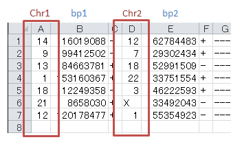

*******************************
Detail of config file (CA)
*******************************

All setting items are :ref:`here<conf_ca>`

Description of columns
-----------------------------

====================  ===============  ==========  ===================================
name                  input type       required    description
====================  ===============  ==========  ===================================
col_chr1              text             o           chromosome of break point 1
col_break1            numeric          o           position of break point 1
col_chr2              text             o           chromosome of break point 2
col_break2            numeric          o           position of break point 2
col_opt_ID            text             x           name that can identify the sample
col_opt_dir1          text             x           direction of break point 1
col_opt_dir2          text             x           direction of break point 2
col_opt_type          text             x           type of variation
col_opt_gene_name1    text             x           gene name of break point 1
col_opt_gene_name2    text             x           gene name of break point 2
col_opt_group         text             x           grouping of mutaions
====================  ===============  ==========  ===================================

.. note::
  
  Col_opt_group is used for grouping stacks. 
  
  If not specified, it is grouped by intra / inter chromosome.
  
  If you specify a column, you can set display contents as follows with options.
  
   - limited_group Limit the group to use
   - nouse_group   Specify an unused group
   - group_colors  Specify the color of group
  
  Setting example
  
  .. code-block:: cfg
    
    limited_group = stopgain,frameshift_deletion,frameshift_insertion
    nouse_group = _blank_,unknown,synonymous_SNV
    group_colors = stopgain:#E85299,frameshift_deletion:#F39600,frameshift_insertion:#E60011

.. note::
  
  Five items are used only in tooltip.
  
   - col_opt_dir1
   - col_opt_dir2
   - col_opt_gene_name1
   - col_opt_gene_name2
   - col_opt_type
   
   .. image:: image/option_sv.PNG
     :scale: 100%

| For how to specify columns, see :ref:`column specification method<column>`.
| For how to designate suffix & ID and how to specify sample name, see :ref:`suffix and ID<suffix>`.
| 

Limit display chromosome
---------------------------------

Edit the following items in the config file.

.. code-block:: cfg

  [ca]
  # use chromosomes (separate with ,)
  # default
  # use_chrs = 1,2,3,4,5,6,7,8,9,10,11,12,13,14,15,16,17,18,19,20,21,22,X,Y
  
  # Case using chromosome 1, 5, 7
  use_chrs = 1,5,7

Specify the edited config file from the command as follows.

``pa_plot {input files} {output directory} {title} --config_file {config file}``

Use a nonhuman genome
-------------------------------

You need a file with genome size entered.

Write the chromosome name in the first column and the size in the second column separeted with ``,`` or ``\t``.

.. code-block:: cfg
  
  1,249250621
  2,243199373
  3,198022430
  7,159138663
  8,146364022
  X,141213431
  Y,135534747
  9_gl000201_random,36148
  11_gl000202_random,40103
  17_gl000204_random,81310
  17_gl000205_random,174588
  Un_gl000214,137718

The chromosome name must be the same as the name used in ``Chr1``, ``Chr2`` of the file you want to analyze.

Write the path to the prepared genome size file in config file.

.. code-block:: cfg

  [genome]
  # path to file listing length of chromosomes（default is hg19)
  #
  # for example.
  # (linux)
  # path = ~/tmp/genome/hg19.csv
  # (windows)
  # path = C:\genome\hg19_part.csv
  path = {write here the path to the prepared genome size file}

Display contents of the tooltip
----------------------------------------

| Refer to :ref:`user-defined format <user_format>` for the description method.
| SV has no special keyword like mutation-matrix.
|

.. |new| image:: image/tab_001.gif
