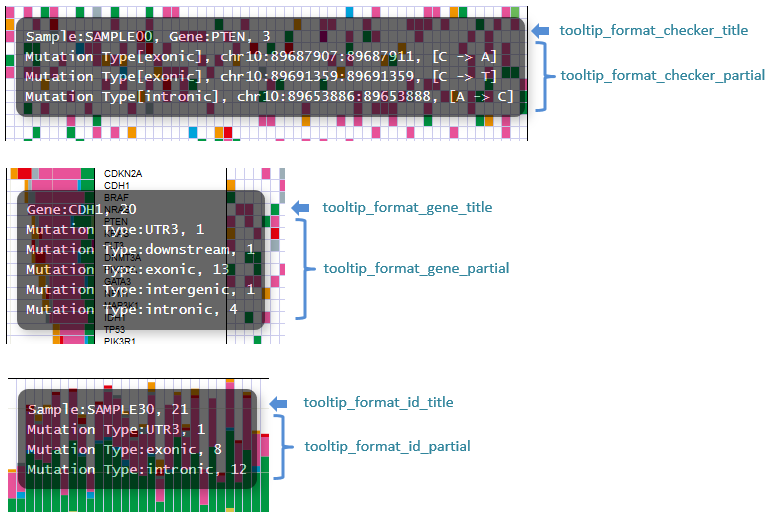
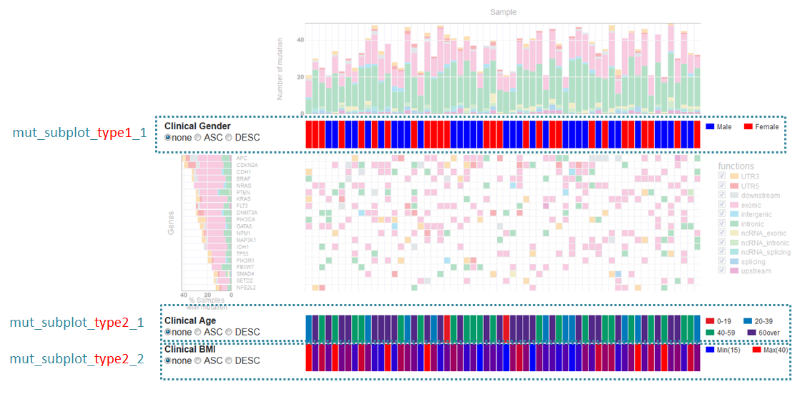
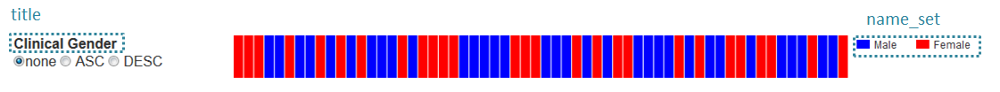
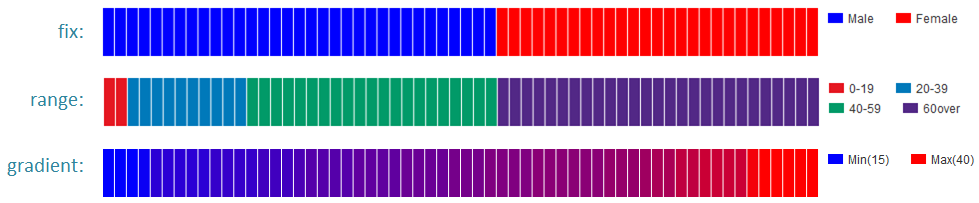

************************************************
Detail of config file (mutation-matrix)
************************************************

All setting items are :ref:`here<conf_mm>`

-----------------------------
Description of columns
-----------------------------

=========================  =============  ==========  ==================================
name                       input type     required    description
=========================  =============  ==========  ==================================
col_func                   text           o           mutation type
col_gene                   text           o           gene name
col_opt_chr                text           x           chromosome
col_opt_start              numeric        x           srart position of break point
col_opt_end                numeric        x           end position of break point
col_opt_ref                text           x           Base sequence of reference
col_opt_alt                text           x           Base sequence of alternative
col_opt_id                 text           x           name that can identify the sample
=========================  =============  ==========  ==================================

| For how to specify columns, see :ref:`column specification method<column>`.
| For how to designate suffix & ID and how to specify sample name, see :ref:`suffix and ID<suffix>`.
| 

----------------------------------------------------------
Display contents of the tooltip
----------------------------------------------------------

| Refer to :ref:`user-defined format <user_format>` for the description method.
|
| Six options are set for each display location, but the way of writing is the same.
| Apart from the data string, it can also be used as a special keyword below.
|

:{#number_id}:      Number of samples
:{#number_gene}:    Number of genes
:{#number_mutaion}: Number of detected mutations (Even if the same sample is detected plural times with the same gene, it counts as 1)
:{#sum_mutaion}:    Number of detected mutations.
:{#item_value}:     Value of one item of stacked graph
:{#sum_item_value}: Total value of stacked graph

| For mutation aggregation, mutations not used are not counted.

**default settings and display**

.. code-block:: cfg

  # grid - title
  tooltip_format_checker_title1 = ID:{ID}, gene:{gene}, {#sum_item_value}
  
  # grid - each func
  tooltip_format_checker_partial = type[{func}], {chr}:{start}:{end}, [{ref} -----> {alt}]
  
  # Graph of genes - title
  tooltip_format_gene_title = gene:{gene}, {#sum_item_value}
  
  # Graph of genes - each func
  tooltip_format_gene_partial = func:{func}, {#item_value}
  
  # Graph of samples - title
  tooltip_format_id_title = ID:{id}, {#sum_item_value}
  
  # Graph of samples - each func
  tooltip_format_id_partial = func:{func}, {#item_value}

-----------------------------
Sub plot
-----------------------------

| In the mutation-matrix graph, you can display information on the sample separately from the analysis result.
| 
| There are two display locations, type1 is displayed below the sample graph and type2 is displayed last.

| When displaying type1, set the section name to [mut_subplot_type1_*].
| When displaying type2, set the section name to [mut_subplot_type2_*].
| 
| Put a sequence number starting with 1 in ``*``. It is displayed in order from 1.
|

.. code-block:: cfg
  :linenos:
  
  # mut_subplot_type1_1
  [mut_subplot_type1_1]
  
  # path to data file
  path = /path/to/file1
  
  ###########################
  # Input file format
  
  # Data separation
  sept = ,
  
  # Whether the first line is a header or not
  header = True
  
  # Comment line
  comment = #
  
  # Column of display data
  col_value = average_depth
  
  # Column of id.（Being associated with main plot)
  col_ID = id
  
  ###########################
  # Sub plot format
  
  # Title of sub plot
  title = bam's average depth
  
  # Display format
  # Select from fix, range, gradient
  mode = gradient
  
  # Legend format
  # For each value fill in as follows, `{value}:{display character string}:{color of the cell}`. {color of the cell} can be omitted
  #
  # Case mode=fix
  # name_set = 0:Male:blue, 1:Female:red, 2:Unknown:gray
  # 
  # Case mode=range, write {value} of range start in value
  # name_set = 0:0-19, 20:20-39, 40:40-59, 60:60over
  # 
  # Case mode = gradient, write {value} the first and last values. When using MIN / MAX, it automatically sets from data.
  # For automatic setting
  # name_set = MIN:min, MAX:max
  # For manual setting
  # name_set = 0:min (0), 40:max (40)
  name_set = MIN:min, MAX:max
  
  # mut_subplot_type2_1
  [mut_subplot_type2_1]
  title = Clinical Gender
  path = /path/to/file2
  sept = ,
  header = True
  comment = 
  col_value = gender
  col_ID = barcode
  mode = fix
  name_set = 0:Male:blue, 1:Female:red, 2:Unknown:gray
  
  #mut_subplot_type2_2
  [mut_subplot_type2_2]
  title = Clinical Age
  path = /path/to/file3
  sept = ,
  header = True
  comment = 
  col_value = age
  col_ID = barcode
  mode = range
  name_set = 0:0-19, 20:20-39, 40:40-59, 60:60over

title and nameset
--------------------------

Difference in display mode
----------------------------

