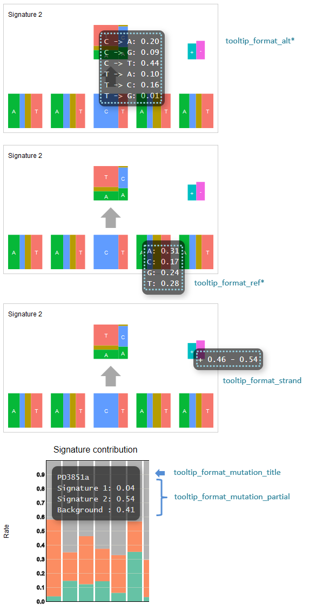

**********************************************
Detail of config file (pmsignature) |new|
**********************************************

All setting items are :ref:`here<conf_pmsignature>`

----------------------------------------------------------
Display contents of the tooltip
----------------------------------------------------------

| Refer to :ref:`user-defined format <user_format>` for the description method.
|
| Five options are set for each display location, but the way of writing is the same.
| The following keywords can be used respectively.
|

**tooltip_format_ref* (Lower five boxes of pmsignature)**

================== ============================================================
keyword            description
================== ============================================================
{a}                value of A
{c}                value of C
{g}                value of G
{t}                value of T
================== ============================================================

**tooltip_format_alt* (Upper one box of pmsignature)**

================== ============================================================
keyword            description
================== ============================================================
{ca}               value of C->A
{cg}               value of C->G
{ct}               value of C->T
{ta}               value of T->A
{tc}               value of T->C
{tg}               value of T->G
================== ============================================================

**tooltip_format_strand**

================== ============================================================
keyword            description
================== ============================================================
{plus}             value of plus
{minus}            value of minus
================== ============================================================

**tooltip_format_mutation_title (Stacked graph)**

================== ============================================================
keyword            description
================== ============================================================
{id}               sample name entered with `key_id`
{#sum_mutaion_all} Total number of mutations
================== ============================================================

**tooltip_format_mutation_partial (Stacked graph)**

================== ============================================================
keyword            description
================== ============================================================
{sig}              name of signature, display as "Signature {signature index}"
{#sum_item_value}  total value of stacked graph
================== ============================================================

**default settings and display**

.. code-block:: cfg

  # pmsignature - lower five boxes
  tooltip_format_ref1 = A: {a:.2}
  tooltip_format_ref2 = C: {c:.2}
  tooltip_format_ref3 = G: {g:.2}
  tooltip_format_ref4 = T: {t:.2}

  # pmsignature - Upper one box
  tooltip_format_alt1 = C -> A: {ca:.2}
  tooltip_format_alt2 = C -> G: {cg:.2}
  tooltip_format_alt3 = C -> T: {ct:.2}
  tooltip_format_alt4 = T -> A: {ta:.2}
  tooltip_format_alt5 = T -> C: {tc:.2}
  tooltip_format_alt6 = T -> G: {tg:.2}

  # pmsignature - strand
  tooltip_format_strand = + {plus:.2} - {minus:.2}
  
  # stacked graph - title
  tooltip_format_mutation_title = {id}
  
  # stacked graph - each signature
  tooltip_format_mutation_partial = {sig}: {#sum_item_value:.2}
  

.. |new| image:: image/tab_001.gif
