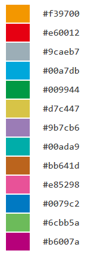

*******************************
Detail of config file (QC)
*******************************

All setting items are :ref:`here<conf_qc>`

Description of columns
-----------------------------

=========================  =============  ==========  ==================================
name                       input type     required    description
=========================  =============  ==========  ==================================
col_opt_duplicate_reads    numeric        x           number of total reads
col_opt_mapped_reads       numeric        x           number of mapped reads
col_opt_total_reads        numeric        x           number of duplicate reads
col_opt_average_depth      numeric        x           mean of insert size
col_opt_mean_insert_size   numeric        x           average of depth
col_opt_ratio_2x           numeric        x           number of read_length_r1
col_opt_ratio_10x          numeric        x           number of read_length_r2
col_opt_ratio_20x          0.0～1.0       x           coverage (depth=2)
col_opt_ratio_30x          0.0～1.0       x           coverage (depth=10)
col_opt_read_length_r1     0.0～1.0       x           coverage (depth=20)
col_opt_read_length_r2     0.0～1.0       x           coverage (depth=30)
col_opt_id                 text           x           name that can identify the sample
=========================  =============  ==========  ==================================

| For how to specify columns, see :ref:`column specification method<column>`.
| For how to designate suffix & ID and how to specify sample name, see :ref:`suffix and ID<suffix>`.
| 

User defined graph
-----------------------------

| In QC, all graphs are user defined.
| ※ It is only stacked graph. It can not be other graphs.
|
| Fill in necessary information in the `` [qc_chart_*] `` section of the config file.
| With [qc_chart_brush] (for brush) as the head and [qc_chart_1],[qc_chart_2],[qc_chart_3] in order.
| [qc_chart_*] section can be increased by the necessary amount.
|
| In the example.cfg, it is set as follows.

.. image:: image/conf_qc1.PNG
  :scale: 100%

** [qc_chart_*] Settings of each section **

| In each section, set the following options.
|

:title: Title of the graph

:title_y: Y axis title

:stack: Stacked elements. If there are more than one, specify stack 1, stack 2, ... in sequential order in the stacking order. Set keywords in {}. For the keywords, see :ref:`user-defined format <user_format>`.

:name_set: Legend name and color of stacked elements. Color is optional. If omitted, default values ​​are used in order from the top.

:tooltip_format: Format of tooltip. If there are more than one, specify tooltip_format1, tooltip_format2, ... in sequential order in the stacking order. Refer to :ref:`user-defined format <user_format>` for the description method.

.. image:: image/conf_qc2.PNG
  :scale: 100%

name_set (With color specification)

.. image:: image/conf_qc3.PNG
  :scale: 100%

name_set (No color specification)

.. image:: image/conf_qc4.PNG
  :scale: 100%

** Default color **

.. |new| image:: image/tab_001.gif
