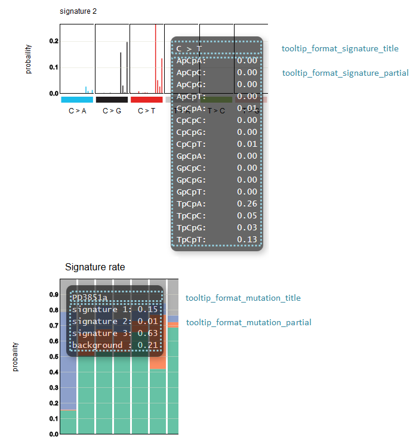

**********************************************
Detail of config file (signature) |new|
**********************************************

All setting items are :ref:`here<conf_signature>`

----------------------------------------------------------
Display contents of the tooltip
----------------------------------------------------------

| Refer to :ref:`user-defined format <user_format>` for the description method.
|
| Four options are set for each display location, but the way of writing is the same.
| The following keywords can be used respectively.
|

**tooltip_format_signature_title**

================== =======================================================================
keyword            description
================== =======================================================================
{sig}              Label of signature group. Display as 'C> A', 'C> G', etc.
{#sum_group_value} Total value of signature group. 
================== =======================================================================

**tooltip_format_signature_partial**

================== =======================================================================
keyword            description
================== =======================================================================
{route}            Label for one bar chart of signature. Display as 'ApCpA', 'CpCpA', etc.
{#sum_item_value}  Value for one bar chart of signature. 
================== =======================================================================

**tooltip_format_mutation_title (Stacked graph)**

================== ============================================================
keyword            description
================== ============================================================
{id}               sample name entered with `key_id`
{#sum_mutaion_all} Total number of mutations
================== ============================================================

**tooltip_format_mutation_partial (Stacked graph)**

================== ============================================================
keyword            description
================== ============================================================
{sig}              name of signature, diplay as "Signature {signature index}"
{#sum_item_value}  total value of stacked graph
================== ============================================================

**default settings and display**

.. code-block:: cfg

  # signature - title
  tooltip_format_signature_title = {sig}
  
  # signature - each item
  tooltip_format_signature_partial = {route}: {#sum_item_value:6.2}
  
  # stacked graph - title
  tooltip_format_mutation_title = {id}
  
  # stacked graph - each signature
  tooltip_format_mutation_partial = {sig}: {#sum_item_value:.2}
  

  
.. |new| image:: image/tab_001.gif
