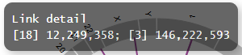
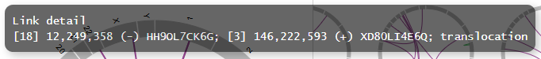

************************************
Chromosomal Aberration Report 
************************************

Here, we show how to generate Chromosomal Aberration Report using sample data [*]_.

.. [*] Sample data is equipped with the ``example`` directory of ``paplot`` directory.

.. _ca_minimal:

==========================
1. Minimal dataset 
==========================

| `View the report generated in this section <http://genomon-project.github.io/paplot/ca_minimal/graph_minimal.html>`_ 
| `View the input data used in this section <https://github.com/Genomon-Project/paplot/blob/master/example/ca_minimal>`_ 
| `Download the input data used in this section <https://github.com/Genomon-Project/paplot/blob/master/example/ca_minimal.zip?raw=true>`_ 

For generating Chromosomal Aberration Report using paplot, at least following 5 items are necessary.

 - Sample ID (Sample)
 - Chromosome of the breakpoint 1 (Chr1)
 - Coordinate of the breakpoint 1 (Break1)
 - Chromosome of the breakpoint 2 (Chr2)
 – Coordinate of the breakpoint 2 (Break2)

.. code-block:: cfg
  :caption: Extracted from the example data (example/ca_minimal/data.csv)
  
  Sample,Chr1,Break1,Chr2,Break2,
  SAMPLE1,14,16019088,12,62784483,
  SAMPLE1,9,99412502,7,129302434,
  SAMPLE1,13,84663781,18,52991509,
  SAMPLE2,11,101374238,22,26701405,
  SAMPLE2,2,121708638,7,137424167,
  SAMPLE3,22,34268355,10,19871820,
  SAMPLE3,8,107868940,hs37d5,20517614,
  SAMPLE4,8,135644313,3,116748248,
  SAMPLE4,7,6037836,21,34855497,
  SAMPLE4,7,109724564,14,106387943,

Set the column names in the [result_format_ca] section of the configuration file.

.. code-block:: cfg
  :caption: example/ca_minimal/paplot.cfg
  
  [result_format_ca]
  col_chr1 = Chr1
  col_break1 = Break1
  col_chr2 = Chr2
  col_break2 = Break2
  col_opt_id = Sample

Then, execute the ``paplot``.

.. code-block:: bash

  paplot ca {unzip_path}/example/ca_minimal/data.csv ./tmp ca_minimal \
  --config_file {unzip_path}/example/ca_minimal/paplot.cfg

----

.. _ca_noheader:

==========================
2. Without header
==========================

| `View the report generated in this section <http://genomon-project.github.io/paplot/ca_noheader/graph_noheader.html>`_ 
| `View the input data used in this section <https://github.com/Genomon-Project/paplot/blob/master/example/ca_noheader>`_ 
| `Download the input data used in this section <https://github.com/Genomon-Project/paplot/blob/master/example/ca_noheader.zip?raw=true>`_ 

.. code-block:: cfg
  :caption: Extracted from the example data (example/ca_noheader/data.csv)
  
  SAMPLE00,intronic,GATA3
  SAMPLE00,UTR3,CDH1
  SAMPLE00,exonic,GATA3
  SAMPLE01,splicing,WASF3
  SAMPLE01,intronic,WASF3
  SAMPLE01,exonic,NRAS
  SAMPLE02,intronic,FBXW7
  SAMPLE02,intronic,GATA3
  SAMPLE02,ncRNA_intronic,ACVR2B
  SAMPLE03,exonic,CAP2
  SAMPLE03,intronic,PIK3CA
  SAMPLE03,downstream,SEPT12

When the input data has not header (column names), then we need to set the column number to each key in the [result_format_ca] section of the configuration file.

.. code-block:: cfg
  :caption: example/ca_noheader/paplot.cfg
  
  [result_format_ca]
  # Set the value of the header option to False
  header = False

  col_chr1 = 2
  col_break1 = 3
  col_chr2 = 4
  col_break2 = 5
  col_opt_id = 1

Then execute ``palot``.

.. code-block:: bash

  paplot ca {unzip_path}/example/ca_noheader/data.csv ./tmp ca_noheader \
  --config_file {unzip_path}/example/ca_noheader/paplot.cfg

----

.. _ca_group:

=============================
3. Customizing categorization
=============================

| `View the report generated in this section <http://genomon-project.github.io/paplot/ca_group/graph_group.html>`_ 
| `View the input data used in this section <https://github.com/Genomon-Project/paplot/blob/master/example/ca_group>`_ 
| `Download the input data used in this section <https://github.com/Genomon-Project/paplot/blob/master/example/ca_group.zip?raw=true>`_ 

In the minimal dataset, chromosomal aberrations are categorized into intra-chromosomal (green) and inter-chromosomal (purple).
We can customize the categorization.
 

.. code-block:: cfg
  :caption: Extracted from the example data (example/ca_group/data.csv)
  
  Sample,Chr1,Break1,Chr2,Break2,Label
  SAMPLE1,14,16019088,12,62784483,C
  SAMPLE1,9,99412502,7,129302434,B
  SAMPLE1,13,84663781,18,52991509,A
  SAMPLE2,11,101374238,22,26701405,B
  SAMPLE2,2,121708638,7,137424167,C
  SAMPLE2,16,43027789,22,23791492,C
  SAMPLE3,22,34268355,10,19871820,A
  SAMPLE3,14,56600342,hs37d5,5744957,B
  SAMPLE3,Y,12191863,hs37d5,29189687,A
  SAMPLE4,8,135644313,3,116748248,D
  SAMPLE4,7,6037836,21,34855497,D
  SAMPLE4,7,109724564,14,106387943,A

In the example data above, a new column, Label, is included as well as Sample, Chr1, Break1, Chr2 and Break2.
First, we set the ``Label`` as the column used for categorization in the [result_format_ca] section in the configuration file.

.. code-block:: cfg
  :caption: example/ca_group/paplot.cfg
  
  [result_format_ca]
  col_opt_group = Label

Also, the color for each category can be set.

.. code-block:: cfg
  :caption: example/ca_group/paplot.cfg

  [ca]
  # Set {Value}:{the name of colour or RGB value} for each category and join them by comma ','.
  group_colors = A:#66C2A5,B:#FC8D62,C:#8DA0CB,D:#E78AC3

  # Display just selected categories.
  limited_group = 
  
  # Not display selected categories.
  nouse_group = 

Then, execute ``paplot``.

.. code-block:: bash

  paplot ca {unzip_path}/example/ca_group/data.csv ./tmp ca_group \
  --config_file {unzip_path}/example/ca_group/paplot.cfg

----

.. _ca_option:

===================================
4. Customizing pop-up information
===================================

| `View the report generated in this section <http://genomon-project.github.io/paplot/ca_option/graph_option.html>`_ 
| `View the input data used in this section <https://github.com/Genomon-Project/paplot/blob/master/example/ca_option>`_ 
| `Download the input data used in this section <https://github.com/Genomon-Project/paplot/blob/master/example/ca_option.zip?raw=true>`_ 

We can customize the pop-up information that appears upon mouseover events.
In the minimal dataset, the pop-up information is shown as below.

 **Before customization**

By customizing pop-up information, we can view more detailed information on each chromosomal aberration.

**After customization**

.. code-block:: cfg
  :caption: Extracted from the example data (example/ca_option/data.csv)
  
  Sample,Chr1,Break1,Dir1,Chr2,Break2,Dir2,Ref,Alt,MutationType,Gene1,Gene2
  SAMPLE1,14,16019088,-,12,62784483,+,---,GACTC,deletion,LS7T1EG444,4GRRIO5AVR
  SAMPLE1,9,99412502,-,7,129302434,+,---,C-CT-,translocation,FQFW16UF5U,QP779MLPNV
  SAMPLE1,13,84663781,+,18,52991509,-,---,GTAAA,deletion,Q9VX1I9U3I,7XM09ETN40
  SAMPLE2,11,101374238,+,22,26701405,+,---,TGGGT,translocation,FZ7LOS66RD,9WYBJR57E0
  SAMPLE2,2,121708638,-,7,137424167,-,---,G-TGA,translocation,5655M5E46B,HB14VJXDHV
  SAMPLE2,16,43027789,+,22,23791492,-,---,CCTCA,inversion,REFSIL0H2M,L5EA31R8U0
  SAMPLE3,22,34268355,+,10,19871820,+,---,TC-GT,tandem_duplication,9SVRQCFVCO,2BEWSO91FZ
  SAMPLE3,14,56600342,-,hs37d5,5744957,+,---,--CAA,deletion,UTLVCZ63SK,5I74M5NKDC
  SAMPLE3,Y,12191863,-,hs37d5,29189687,-,---,TG-G-,inversion,3PLD4C20IZ,BVYMBTIFKD

In this example, the following 7 (optional) columns are added as well as 5 required columns.

 - Reference base (Ref)
 - Alternative base (Alt)
 - Mutation type (MutationType)
 - Gene affected by the breakpoint 1 (Gene1)
 - Gene affected by the breakpoint 2 (Gene2)
 - Direction of the breakpoint 1 (Dir1)
 - Direction of the breakpoint 2 (Dir2)

First, add these columns to the [result_format_ca] section in the configuration file.

.. code-block:: cfg
  :caption: example/ca_option/paplot.cfg
  
  [result_format_ca]
  col_opt_dir1 = Dir1
  col_opt_dir2 = Dir2
  col_opt_type = MutationType
  col_opt_gene_name1 = Gene1
  col_opt_gene_name2 = Gene2
  col_opt_dir1 = Dir1
  col_opt_dir2 = Dir2

The colum names of optional items can be set as: ``col_opt_{keyword} = {actual column name}``.

 - the part ``{keyword}`` can be set arbitrarily. However, always start with ``col_opt_``.
 - the characters that can be used for ``{keyword}`` is 1-9, a-z, A-Z and _.
 - ``col_opt_id`` has to be used only for sample ID.

Then, modify the [ca] section in the configuration file.

.. code-block:: cfg
  :caption: example/ca_option/paplot.cfg
  
  [ca]
  # before customization
  # tooltip_format = [{chr1}] {break1:,}; [{chr2}] {break2:,}
  # after customization  
  tooltip_format = [{chr1}] {break1:,} ({dir1}) {gene_name1}; [{chr2}] {break2:,} ({dir2}) {gene_name2}; {type}

Then, execute ``paplot``.

.. code-block:: bash

  paplot ca {unzip_path}/example/ca_option/data.csv ./tmp ca_option \
  --config_file {unzip_path}/example/ca_option/paplot.cfg

For more detailed description on how to set pop-up information (``tooltip_format``), please refer to `ユーザ定義フォーマット <./data_common.html#user-format>`_.

.. |new| image:: image/tab_001.gif
