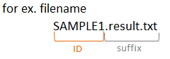

**************************
Common Issues
**************************

Here, we describe several common issues that are helpful in generating reports using sample data [*]_.

.. [*] The sample data is equipped with the ``example`` directory of the paplot directory.

.. _sept:

================================
1. Delimiter for the input data
================================

When the delimiter for the input data is tab or space character, modify the configuration file as follows: 

.. code-block:: cfg

  # For the case of Mutation Matrix Report
  [result_format_mutation]
  sept = \t

  # for the case of space character
  sept = " "

For QC and Chromosomal Aberration report, change the ``[result_format_qc]`` and ``[result_format_ca]`` sections.

----

.. _comment:

==========================
2. Comment line 
==========================

.. code-block:: cfg
  
  # This is comment.
  # Please skip this line.
  
  ID,Type,Gene
  SAMPLE00,intronic,GATA3
  SAMPLE00,UTR3,CDH1

In the default setting, the character "#" is used to denote the start of a comment line,
and paplot ignores it. To change the character for the comment line, modify the configuration file as follows:

.. code-block:: cfg

  # For the case of Mutation Matrix Report
  [result_format_mutation]
  comment = #

For QC and Chromosomal Aberration report, change the ``[result_format_qc]`` and ``[result_format_ca]`` sections.

----

.. _suffix:

======================================
3. Processing multiple input data
======================================

Generally, cancer genome study uses multiple sequence data, and the reports generated by paplot consist of information from multiple samples.
There are two approaches for preparing input data with multiple samples for paplot,

 - case1: Single merged input data

   In this case, there should be a column for the sample name (that should be set in the key ``col_opt_id`` in the configuration file).
 
 - case2: Multiple input data divided among individual samples
 
   In this case, paplot discern samples names by file names (by removing the character set by the ``suffix`` key in the configuration file).
   Alternatively, set the column for the sample name (and set the ``col_opt_id`` in the configuration file) for each input file.

In the previous examples, we generally used merged input data (case 1 above). Here, we describe the procedure for generating a report using multiple input data (case 2).

| `View the report generated in this section. <https://github.com/Genomon-Project/paplot/blob/master/example/mutation_split_file>`_ 
| `Download the input data used in this section. <https://github.com/Genomon-Project/paplot/blob/master/example/mutation_split_file.zip?raw=true>`_ 

::

  example/mutation_split_file/

     # Input data files 
    ┣ SAMPLE00.data.csv  # input data for SAMPLE00
    ┣ SAMPLE01.data.csv  # input data for SAMPLE01
    ┣ SAMPLE02.data.csv  # input data for SAMPLE02
    ┣ SAMPLE03.data.csv  # input data for SAMPLE03
    ┣ SAMPLE04.data.csv  # input data for SAMPLE04

     # Configuration file
    ┗ paplot.cfg

.. code-block:: cfg
  :caption: example/mutation_split_file/SAMPLE00.data.csv

  MutationType,Gene
  intronic,GATA3
  intronic,FLT3
  intronic,FLT3
  UTR3,CDH1
  exonic,GATA3

Set the ``suffix`` key in the configuration file.

.. code-block:: cfg
  :caption: example/mutation_split_file/paplot.cfg

   [result_format_mutation]
   suffix = .data.csv
   
   # Do not use the col_opt_id
   col_opt_id = 

When the ``suffix`` key is set, the file name before the ``suffix`` characters becomes the sample name.

Then, execute paplot.

.. code-block:: bash

  # For the case of Mutation Matrix Report

  # When setting each input file, join them by ','.
  paplot mutation {unzip_path}/example/mutation_split_file/SAMPLE00.data.csv,{unzip_path}/example/mutation_split_file/SAMPLE01.data.csv ./tmp mutation_split_file \
  --config_file {unzip_path}/example/mutation_split_file/paplot.cfg

  # Moreover, wild-card character can be used. (Enclose in double quotations).
  paplot mutation "{unzip_path}/example/mutation_split_file/*.csv" ./tmp mutation_split_file \
  --config_file {unzip_path}/example/mutation_split_file/paplot.cfg

For QC and Chromosomal Aberration report, change the ``[result_format_qc]`` and ``[result_format_ca]`` sections.

.. _keyword:

==============================
4. Keyword
==============================

4-1. About keyword
----------------------------

For each column name, we can set the keyword by setting the configuration file.
Keywords will be used for customizing pop-up information, etc.

**Configuration file**

.. code-block:: cfg
  
  [result_format_mutation]
  # Required items
  # col_{key} = {actual column name}
  #
  col_gene = Gene
  col_group = MutationType
  
  # Optional items
  # col_opt_{key} = {actual column name}
  #
  col_opt_id = Sample
  col_opt_start = Start
  col_opt_end = End

``col_{keyword} = {actual column name}`` or ``col_opt_{keyword} = {actual column name}`` entries, ``{keyword}`` will be the keyword.

Please note the following points:

 - The keywords are case-independent. For example, CHR, Chr, and chr are considered identical.
 - The part ``{keyword}`` can be set arbitrarily. However, always start with ``col_opt_``.
 - ``col_opt_id`` is to be used only for sample ID.
 - For Mutation Matrix and Chromosomal Aberration Report, ``col_opt_group`` is also reserved for grouping and cannot be used for other purposes.
 - Mutational Signature Report and pmsignature Report does not use these keywords.
 
.. _user_format:

==============================
5. User defined format
==============================

We can customize the pop-up information that appears upon mouseover events.

For each report and graph, it is necessary to set up the contents of pop-up information.
However, the manner of writing is similar.

**Configuration file**

::

  tooltip_format_checker_partial = type[{func}], {chr}:{start}:{end}, [{ref} -> {alt}]
  
  # will be displayed as: 
  type[exome], chr1:2000:2001, [A -> T]

The words surrounded by {} are keywords; when the pop-up information is displayed,
keywords will be replaced by the actual value.

`About Keyword <./data_common.html#keyword>`_ 

5-1. Numerical calculation
----------------------------

paplot can use one or more keywords to perform numerical calculations.

::
  
  {key1/key2*100}%
  
  # will be displayed as (no rounding)
  3.33333333333333%

If you wish to round-off decimals, 
add the value for the number of digits to be displayed after the decimal point; 
e.g. add ``: .2`` to display two digits after the decimal point in the keyword value.

::

  {key1/key2*100:.2}%
  
  # will be displayed as (with rounding)
  3.33%

5-2. Separated digits
------------------------------

If you wish to put commas in every third digit, add ``: ,`` after the keyword value.

::

  {key1}
  
  # will be displayed as (with no digit separator)
  123456789

::

  {key1:,}
  
  # will be displayed as (with digit separator)
  123,456,789

.. |new| image:: image/tab_001.gif
