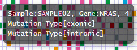
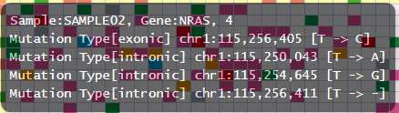

**************************
Mutation Matrix レポート
**************************

Here, we show how to generate Mutation Matrix report using sample data [*]_.

.. [*] Sample data is equipped with the ``example`` directory of ``paplot`` directory.

.. _mm_minimal:

==========================
1. Minimal dataset
==========================

 * `View the report generated in this section <http://genomon-project.github.io/paplot/mutation_minimal/graph_minimal.html>`_ 
 * `View the input data used in this section <https://github.com/Genomon-Project/paplot/blob/master/example/mutation_minimal>`_ 
 * `Download the input data used in this section <https://github.com/Genomon-Project/paplot/blob/master/example/mutation_minimal.zip?raw=true>`_ 

For generating Mutation Matrix Report using paplot, at least sample ID (Sample), gene name (Gene) and mutation type (MutationType) is necessary.

.. code-block:: cfg
  :caption: Extracted from the example data (example/mutation_minimal/data.csv)
  
  Sample,MutationType,Gene
  SAMPLE00,intronic,GATA3
  SAMPLE00,UTR3,CDH1
  SAMPLE00,exonic,GATA3
  SAMPLE01,splicing,WASF3
  SAMPLE01,intronic,WASF3
  SAMPLE01,exonic,NRAS
  SAMPLE02,intronic,FBXW7
  SAMPLE02,intronic,GATA3
  SAMPLE02,ncRNA_intronic,ACVR2B
  SAMPLE03,exonic,CAP2
  SAMPLE03,intronic,PIK3CA
  SAMPLE03,downstream,SEPT12

Although the column names are Sample, MutationType and Gene, they can be arbitrary changed.

Set the column names in the [result_format_mutation] section of the configuration file.

.. code-block:: cfg
  :caption: example/mutation_minimal/paplot.cfg

  [result_format_mutation]
  col_group = MutationType
  col_gene = Gene
  col_opt_id = Sample

Then, execute the ``paplot``.

.. code-block:: bash

  paplot mutation {unzip_path}/example/mutation_minimal/data.csv ./tmp mutation_minimal \
  --config_file {unzip_path}/example/mutation_minimal/paplot.cfg

----

.. _mm_noheader:

==========================
2. Without header
==========================

| `View the report generated in this section <http://genomon-project.github.io/paplot/mutation_noheader/graph_noheader.html>`_ 
| `View the input data used in this section <https://github.com/Genomon-Project/paplot/blob/master/example/mutation_noheader>`_ 
| `Download the input data used in this section <https://github.com/Genomon-Project/paplot/blob/master/example/mutation_noheader.zip?raw=true>`_ 

.. code-block:: cfg
  :caption: Extracted from the example data (example/mutation_noheader/data.csv)

  SAMPLE00,intronic,GATA3
  SAMPLE00,UTR3,CDH1
  SAMPLE00,exonic,GATA3
  SAMPLE01,splicing,WASF3
  SAMPLE01,intronic,WASF3
  SAMPLE01,exonic,NRAS
  SAMPLE02,intronic,FBXW7
  SAMPLE02,intronic,GATA3
  SAMPLE02,ncRNA_intronic,ACVR2B
  SAMPLE03,exonic,CAP2
  SAMPLE03,intronic,PIK3CA
  SAMPLE03,downstream,SEPT12

When the input data has not header (column names), then we need to set the column number to each key in the [result_format_mutation] section of the configuration file.

.. code-block:: cfg
  :caption: example/mutation_noheader/paplot.cfg
  
  [result_format_mutation]
  # Set the value of the header option to false
  header = False
  
  col_group = 2
  col_gene = 3
  col_opt_id = 1

Then execute ``palot``.

.. code-block:: bash

  paplot mutation {unzip_path}/example/mutation_noheader/data.csv ./tmp mutation_noheader \
  --config_file {unzip_path}/example/mutation_noheader/paplot.cfg

----

.. _mm_option:

===================================
3. Adding pop-up information
===================================

| `View the report generated in this section <http://genomon-project.github.io/paplot/mutation_option/graph_option.html>`_ 
| `View the input data used in this section <https://github.com/Genomon-Project/paplot/blob/master/example/mutation_option>`_ 
| `Download the input data used in this section <https://github.com/Genomon-Project/paplot/blob/master/example/mutation_option.zip?raw=true>`_ 

We can customize the pop-up information that appears upon mouseover events.
In the minimal dataset, the pop-up information shows sample, gene and mutation type as below.

**Before customization**

By customizing the configuration file, the information of positions and substitution types can be added.

**After customization**

.. code-block:: cfg
  :caption: Extracted from the example data (example/mutation_option/data.csv)
  
  Sample,Chr,Start,End,Ref,Alt,MutationType,Gene
  SAMPLE00,chr10,8114472,8114474,A,C,intronic,GATA3
  SAMPLE00,chr13,28644892,28644901,G,-,intronic,FLT3
  SAMPLE00,chr13,28664636,28664638,-,G,intronic,FLT3
  SAMPLE00,chr16,68795521,68795530,-,T,UTR3,CDH1
  SAMPLE00,chr10,8117068,8117069,G,T,exonic,GATA3
  SAMPLE00,chr3,178906688,178906688,G,A,intronic,PIK3CA
  SAMPLE00,chr13,28603715,28603715,G,-,intergenic,FLT3
  SAMPLE00,chr14,103368263,103368270,G,C,intronic,TRAF3
  SAMPLE00,chr1,26505548,26505557,T,C,exonic,CNKSR1
  SAMPLE00,chr7,140619975,140619979,-,G,intronic,BRAF
  SAMPLE00,chr14,103320225,103320225,-,T,downstream,TRAF3

In the example data above, the following 5 (optional) items are added as well as sample ID, gene name and mutation type (required items).

 - Chromosome (Chr)
 - Variant start position (Start)
 - Variant end position (End)
 - Reference base (Ref)
 - Alternative base (Alt) 

First, add these columns to the [result_format_mutation] section in the configuration file.

.. code-block:: cfg
  :caption: example/mutation_option/paplot.cfg
  
  [result_format_mutation]
  col_opt_chr = Chr
  col_opt_start = Start
  col_opt_end = End
  col_opt_ref = Ref
  col_opt_alt = Alt

The column names of optional items can be set as: ``col_opt_{keyword} = {actual column name}``.

 - the part ``{keywrod}`` can be set arbitrarily. However, always start with ``col_opt_``.
 - the characters that can be used for ``{keyword}`` is 1-9, a-z, A-Z and _.
 - ``col_opt_id`` has to be used only for sample ID.
 
Then, modify the [mutatoin] section in the configuration file.

.. code-block:: cfg
  :caption: example/mutation_option/paplot.cfg
  
  [mutation]
  # before customization 
  # tooltip_format_checker_partial = Mutation Type[{group}]
  # after customization 
  tooltip_format_checker_partial = Mutation Type[{group}], {chr}:{start}:{end}, [{ref} -> {alt}]

Then, execute ``paplot``.

.. code-block:: bash

  paplot mutation {unzip_path}/example/mutation_option/data.csv ./tmp mutation_option \
  --config_file {unzip_path}/example/mutation_option/paplot.cfg

Here, we show how to customize the pop-up for each element in the main grid. For customizing other pop-ups, please refer `ポップアップの表示内容 <./config.html#mm-tooltip>`_.

Also, for more detailed description on how to set pop-up information, please refer `ユーザ定義フォーマット <./data_common.html#user-format>`_.

.. |new| image:: image/tab_001.gif
