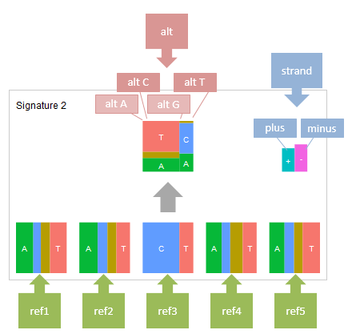

**************************
pmsignature Report 
**************************

Here, we show how to generate pmsignature Report using sample data [*]_.

 .. [*] Sample data is equipped with the ``example`` directory of paplot directory.

.. _json_ind:

==========================
1. Input data format
==========================

To generate pmsignature Report using paplot, json format input data is necessary.
The example (example/pmsignature_stack/data2.json) is as follows:

.. code-block:: python
  :caption: Extracted from the example data (example/pmsignature_stack/data2.json)

  {
    "ref":[
            [ # pmsignature 1
              [0.338,0.15,0.183,0.327],  # ref1 (A,C,G,T)
              [0.362,0.191,0.177,0.267], # ref2 (A,C,G,T)
              [0,0.731,0,0.268],         # ref3 (A,C,G,T)
              [0.31,0.165,0.251,0.272],  # ref4 (A,C,G,T)
              [0.295,0.193,0.168,0.341]  # ref5 (A,C,G,T)
            ],
            [ # pmsignature 2
              [0.179,0.414,0.084,0.321],
              [0.007,0.025,0.004,0.962],
              [0,0.999,0,0],
              [0.472,0.104,0.041,0.381],
              [0.277,0.175,0.284,0.262]
            ]
          ],
    "alt":[
            [ # pmsignature 1
              [0,0,0,0],                 # altA (A,C,G,T)
              [0.194,0,0.091,0.445],     # altC (A,C,G,T)
              [0,0,0,0],                 # altG (A,C,G,T)
              [0.093,0.163,0.011,0]      # altT (A,C,G,T)
            ],
            [ # pmsignature 2
              [0,0,0,0],
              [0.059,0,0.437,0.502],
              [0,0,0,0],
              [0,0,0,0]
            ]
          ],
    "strand":[
              [0.461,0.538],  # pmsignature 1
              [0.512,0.487]   # pmsignature 2
             ],
    "id":["PD3851a","PD3890a","PD3904a"],
    "mutation":[[0,0,0.535],[0,1,0.038],[0,2,0.426],[1,0,0.186],[1,1,0.156],[1,2,0.656]],
    "mutation_count":[702,2312,2096]
  }

**Elements of the input data for pmsignature Report**

:ref:
  | Values for reference bases (in the order of A, C, G and T) for each mutation signature.
  | Not necessary sum-to-one (normalized within the program).
  | In this example, the number of bases is 5. But can be changed to any arbitrary numbers (such as 3 or 7).

:alt:
  | Values for alternative base (in the order of A, C, G and T for each central reference base) for each mutation signature.
  | Four values (in the order of A, C, G and T) for each reference base A, C, G and T.  Therefore, in total 16 values are necessary for each mutation signature.
  | Usually, the central vase is fixed to C or T. Therefore, values whose reference bases are A or G contribute little on the visualization (and thus can be set to zeros).

:strand:
  | Values for the strand (in the order of plus and minus) for each mutation signature.
  | When strand biasness is not taken into account, just set ``[0, 0]``.

**Elements for signature contribution graph**

This graph is optional.

Signature contribution graph shows how much amount of mutations are associated with each mutation signature.
When *id*, *mutation* and *mutation_count* are set in the input json file,
then signature contribution graph are generated (`example <http://genomon-project.github.io/paplot/pmsignature_stack/graph_stack2.html>`_).

:id:
  |  List of samples. For each sample, sample indices are assigned (in this example, PD3851a=0、PD3890a=1、PD3904a=2 and so on). 

:mutation_count:
  | The number of mutations for each sample (in this example, the mutation number for PD3851a =702, the mutation number for PD3890a = 2312 and so on).

:mutation:
  |  Contribution ratio of each mutation signature to each sample ([sample index, signature index, value]).
  |
  | The indice for mutation signature (signature index) are assigned in the listed order in the signature key.
  | In the above example, (signature1 = 0, signature2 = 1, signature3 = 2). 

.. note::

  The keys in the input json file can be modified by changing contents in the ``[result_format_pmsignature]`` section of the configuration file.

  .. code-block:: cfg
    :caption:  paplot/example/pmsignature_stack/paplot.cfg
    
    [result_format_pmsignature]
    format = json
    background = True
    key_ref = ref
    key_alt = alt
    key_strand = strand
    key_id = id
    key_mutation = mutation
    key_mutation_count = mutation_count
            
.. note::

    How to validate json file format
 
    paplot using `json` python package. When loading the input file using load function from json package, then the input file is valid json format.

    Example, when the file fine name is "data2.json".

    .. code-block:: shell
  
      $ python
      >>> import json
      >>> json.load(open("data2.json"))

----

.. _pm_minimal:

==========================
2. Minimal dataset 
==========================

| `View the report generated in this section <http://genomon-project.github.io/paplot/pmsignature_minimal/graph_pmsignature_minimal2.html>`__ 
| `View the input data used in this section <https://github.com/Genomon-Project/paplot/blob/master/example/pmsignature_minimal>`__ 
| `Download the input data used in this section <https://github.com/Genomon-Project/paplot/blob/master/example/pmsignature_minimal.zip?raw=true>`__ 

For the format of input data, please refer to :ref:`here <json>`.

.. code-block:: json
  :caption: example/pmsignature_minimal/data.json
  
  {
    "ref":[[[0.189,0.395,0.088,0.326],[0.019,0.029,0.01,0.94],[0,0.999,0,0],[0.467,0.103,0.054,0.374],[0.278,0.175,0.276,0.268]]],
    "alt":[[[0,0,0,0],[0.063,0,0.415,0.521],[0,0,0,0],[0,0,0,0]]],
    "strand":[[0.514,0.485]]
  }

Configuration file

.. code-block:: cfg
  :caption: example/pmsignature_minimal/paplot.cfg
  
  [pmsignature]
  tooltip_format_ref1 = A: {a:.2}
  tooltip_format_ref2 = C: {c:.2}
  tooltip_format_ref3 = G: {g:.2}
  tooltip_format_ref4 = T: {t:.2}
  tooltip_format_alt1 = C -> A: {ca:.2}
  tooltip_format_alt2 = C -> G: {cg:.2}
  tooltip_format_alt3 = C -> T: {ct:.2}
  tooltip_format_alt4 = T -> A: {ta:.2}
  tooltip_format_alt5 = T -> C: {tc:.2}
  tooltip_format_alt6 = T -> G: {tg:.2}
  tooltip_format_strand = + {plus:.2} - {minus:.2}
  
  color_A = #06B838
  color_C = #609CFF
  color_G = #B69D02
  color_T = #F6766D
  color_plus = #00BEC3
  color_minus = #F263E2
  
  [result_format_pmsignature]
  format = json
  background = True
  key_ref = ref
  key_alt = alt
  key_strand = strand

Execute paplot.

.. code-block:: bash

  paplot pmsignature pmsignature_minimal/data.json ./tmp pmsignature_minimal \
  --config_file ./pmsignature_minimal/paplot.cfg

Then the report is generated in the `tmp` directory.

Here, the file name (`graph_pmsignature2.html`) are determined by the number of mutation signatures (interpreted automatically from the input data).

::

  ./tmp
    ┗ pmsignature_minimal
        ┗ graph_pmsignature2.html

.. note::

  Since one signature is assigned to backgroud signature in this example, the last signature in the contribution graph is background signature.

----

.. _pm_mclass:

======================================================================
3. Mutation signature with multiple various number of signatures
======================================================================

| View the report generated in this section

 - `pmsignature 2 <http://genomon-project.github.io/paplot/pmsignature_multi_class/graph_multi_class2.html>`__ 
 - `pmsignature 3 <http://genomon-project.github.io/paplot/pmsignature_multi_class/graph_multi_class3.html>`__ 
 - `pmsignature 4 <http://genomon-project.github.io/paplot/pmsignature_multi_class/graph_multi_class4.html>`__ 
 - `pmsignature 5 <http://genomon-project.github.io/paplot/pmsignature_multi_class/graph_multi_class5.html>`__ 
 - `pmsignature 6 <http://genomon-project.github.io/paplot/pmsignature_multi_class/graph_multi_class6.html>`__ 

| `View the input data used in this section <https://github.com/Genomon-Project/paplot/blob/master/example/pmsignature_multi_class>`__ 
| `Download the input data used in this section <https://github.com/Genomon-Project/paplot/blob/master/example/pmsignature_multi_class.zip?raw=true>`__ 

For the format of input data, please refer to :ref:`here <json>`.

When generating Mutation Signature Report with various number of signatures,
the input data for each signature number and configuration file are necessary.

In this example dataset, following files are prepared.

::

  example/pmsignature_multi_class/

     # Input data files
    ┣ data2.json  # pmsignature num = 2
    ┣ data3.json  # pmsignature num = 3
    ┣ data4.json  # pmsignature num = 4
    ┣ data5.json  # pmsignature num = 5
    ┣ data6.json  # pmsignature num = 6

     # Configuration file  
    ┗ paplot.cfg

Execute paplot for each mutation signature number.

.. code-block:: bash

  paplot pmsignature pmsignature_multi_class/data2.json ./tmp pmsignature_multi_class \
  --config_file ./pmsignature_multi_class/paplot.cfg

  paplot pmsignature pmsignature_multi_class/data3.json ./tmp pmsignature_multi_class \
  --config_file ./pmsignature_multi_class/paplot.cfg

  paplot pmsignature pmsignature_multi_class/data4.json ./tmp pmsignature_multi_class \
  --config_file ./pmsignature_multi_class/paplot.cfg

  paplot pmsignature pmsignature_multi_class/data5.json ./tmp signature_multi_class \
  --config_file ./pmsignature_multi_class/paplot.cfg

  paplot pmsignature pmsignature_multi_class/data6.json ./tmp pmsignature_multi_class \
  --config_file ./pmsignature_multi_class/paplot.cfg

Or execute the following batch command.

.. code-block:: bash

  paplot pmsignature "pmsignature_multi_class/data*.json" ./tmp pmsignature_multi_class \
  --config_file ./pmsignature_multi_class/paplot.cfg

Then the report is generated in the `tmp` directory.

Here, the file name (`graph_pmsignature2.html`) are determined by the number of mutation signatures (interpreted automatically from the input data).

::

  ./tmp
    ┗ pmsignature_multi_class
        ┣ graph_pmsignature2.html
        ┣ graph_pmsignature3.html
        ┣ graph_pmsignature4.html
        ┣ graph_pmsignature5.html
        ┗ graph_pmsignature6.html

.. note::

  Since one signature is assigned to backgroud signature in this example, the last signature in the contribution graph is background signature.

----

.. _pm_stack:

===================================
4. Signature contribution graph 
===================================

| View the report generated in this section 

 - `pmsignature 2 <http://genomon-project.github.io/paplot/pmsignature_stack/graph_stack2.html>`__ 
 - `pmsignature 3 <http://genomon-project.github.io/paplot/pmsignature_stack/graph_stack3.html>`__ 
 - `pmsignature 4 <http://genomon-project.github.io/paplot/pmsignature_stack/graph_stack4.html>`__ 
 - `pmsignature 5 <http://genomon-project.github.io/paplot/pmsignature_stack/graph_stack5.html>`__ 
 - `pmsignature 6 <http://genomon-project.github.io/paplot/pmsignature_stack/graph_stack6.html>`__ 

| `View the input data used in this section <https://github.com/Genomon-Project/paplot/blob/master/example/pmsignature_stack>`__ 
| `Download the input data used in this sectio <https://github.com/Genomon-Project/paplot/blob/master/example/pmsignature_stack.zip?raw=true>`__ 

Here, we add a signature contribution graph.

For the format of input data, please refer to :ref:`here <json_ind>`.

For generating report with various signature numbers, please refer to :ref:`here <pm_mclass>`.

Execute paplot.

.. code-block:: bash
  
  paplot pmsignature "pmsignature_stack/data*.json" ./tmp pmsignature_stack \
  --config_file ./pmsignature_stack/paplot.cfg

.. note::

  Since one signature is assigned to backgroud signature in this example, the last signature in the contribution graph is background signature.

----

.. _pm_nobackground:

==========================
5. Without background
==========================

| `View the report generated in this section <http://genomon-project.github.io/paplot/pmsignature_nobackground/graph_nobackground2.html>`__ 
| `View the input data used in this section <https://github.com/Genomon-Project/paplot/blob/master/example/pmsignature_nobackground>`__ 
| `Download the input data used in this section <https://github.com/Genomon-Project/paplot/blob/master/example/pmsignature_nobackground.zip?raw=true>`__ 

Here, we generate a pmsignature Report without background.

Set the backgroud option to False in the configuration file.

.. code-block:: cfg
  :caption: example/pmsignature_nobackground/paplot.cfg

  [result_format_pmsignature]
  background = False

Then, execute paplot.

.. code-block:: bash

  paplot pmsignature pmsignature_nobackground/data.json ./tmp pmsignature_nobackground \
  --config_file ./pmsignature_nobackground/paplot.cfg

.. |new| image:: image/tab_001.gif
