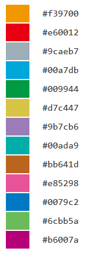

**************************
QC Report 
**************************

Here, we show how to generate QC report using sample data [*]_.

.. [*] Sample data is equipped with the ``example`` directory of paplot directory.

.. _qc_minimal:

==========================
1. Minimal dataset 
==========================

| `View the report generated in this section <http://genomon-project.github.io/paplot/qc_minimal/graph_minimal.html>`__ 
| `View the input data used in this section <https://github.com/Genomon-Project/paplot/blob/master/example/qc_minimal>`__ 
| `Download the input data used in this section <https://github.com/Genomon-Project/paplot/blob/master/example/qc_minimal.zip?raw=true>`__ 

For generating QC Report using paplot, sample ID (Sample) and QC items (at least one) are necessary.
In this example, we adopt mean sequence depth (AverageDepth).

.. code-block:: cfg
  :caption: Extracted from the example data (example/qc_minimal/data.csv)
  
  Sample,AverageDepth
  SAMPLE1,70.0474
  SAMPLE2,65.7578
  SAMPLE3,63.3750
  SAMPLE4,70.9654
  SAMPLE5,69.9653

First, set the column names in the ``[result_format_qc]`` section of the configuration file.

.. code-block:: cfg
  :caption: example/qc_minimal/paplot.cfg
  :name: example/qc_minimal/paplot.cfg_1
  
  [result_format_qc]
  col_opt_id = Sample
  col_opt_key1 = AverageDepth

The column names of optional items can be set as: ``col_opt_{keyword} = {actual column name}``.

For more detailed description on keyword, please refer to `About keyword <./data_common.html#keyword>`_.

Then, add ``[qc_chart_1]`` section to the configuration file and fill the contents within it. 

.. code-block:: cfg
  :caption: example/qc_minimal/paplot.cfg
  :name: example/qc_minimal/paplot.cfg_2
  
  [qc_chart_1]
  
  # Title of the graph
  title = Depth average
 
  # Lable of the Y axis
  title_y = Average of depth
  
  # Items for the stacked bargraph
  # In this example, just one item is used and the graph is displayed as non-stacked bargraph
  stack1 = {key1}
  
  # Colour and legend of the graph
  name_set = Average depth:#2478B4
  
  # Pop-up information
  tooltip_format1 = Sample:{id}
  tooltip_format2 = {key1:.2}

.. note::

  Here, ``{key1}`` used above is the ``{keyword}`` specified in the ``[result_format_qc]`` section.
  
  - For more detailed description on how to set ``name_set``, please refer to `How to set name_set <./data_qc.html#qc-nameset>`_.
  - For more detailed description on how to set ``tooltip_format``, please refer to `User defined format <./data_common.html#user-format>`_.

Then, execute paplot.

.. code-block:: bash

  paplot qc {unzip_path}/example/qc_minimal/data.csv ./tmp qc_minimal \
  --config_file {unzip_path}/example/qc_minimal/paplot.cfg

----

.. _qc_noheader:

==========================
2. Without header
==========================

| `View the report generated in this section <http://genomon-project.github.io/paplot/qc_noheader/graph_noheader.html>`__ 
| `View the input data used in this section <https://github.com/Genomon-Project/paplot/blob/master/example/qc_noheader>`__ 
| `Download the input data used in this section <https://github.com/Genomon-Project/paplot/blob/master/example/qc_noheader.zip?raw=true>`__ 

.. code-block:: cfg
  :caption: Extracted from the example data (example/qc_noheader/data.csv)
  
  SAMPLE1,70.0474
  SAMPLE2,65.7578
  SAMPLE3,63.3750
  SAMPLE4,70.9654
  SAMPLE5,69.9653

When the input data has not header (column names), then we need to set the column number to each key in the ``[result_format_qc]`` section of the configuration file.

.. code-block:: cfg
  :caption: example/qc_noheader/paplot.cfg
  
  [result_format_qc]
  # Set the value of the header option to False 
  header = False

  col_opt_id = 1
  col_opt_average_depth = 2

Then execute paplot.

.. code-block:: bash

  paplot qc {unzip_path}/example/qc_noheader/data.csv ./tmp qc_noheader \
  --config_file {unzip_path}/example/qc_noheader/paplot.cfg

----

.. _qc_stack:

==========================
3. Stacked bargraph
==========================

| `View the report generated in this section <http://genomon-project.github.io/paplot/qc_stack/graph_stack.html>`__ 
| `View the input data used in this section <https://github.com/Genomon-Project/paplot/blob/master/example/qc_stack>`__ 
| `Download the input data used in this section <https://github.com/Genomon-Project/paplot/blob/master/example/qc_stack.zip?raw=true>`__ 

Here, we generate a report with a stacked bargraph as well as a normal bargraph (generated in the minimal dataset example).

.. code-block:: cfg
  :caption: Extracted from the example data (example/qc_stack/data.csv)
  
  Sample,AverageDepth,ReadLengthR1,ReadLengthR2
  SAMPLE1,70.0474,265,270
  SAMPLE2,65.7578,140,200
  SAMPLE3,63.375,120,175
  SAMPLE4,70.9654,120,140
  SAMPLE5,69.9653,230,110

|

 - chart_1 [normal bargraph] AverageDepth (the same as the minimal dataset example)
 - chart_2 [stacked bargraph] ReadLengthR1, ReadLengthR2

First, add these columns to the ``[result_format_qc]`` section in the configuration file.

.. code-block:: cfg
  :caption: example/qc_multi_plot/paplot.cfg
  :name: example/qc_multi_plot/paplot.cfg_1
  
  [result_format_qc]
  col_opt_id = Sample
  
  # Column used in the chart_1
  col_opt_keyA1 = AverageDepth
  
  # Column used in the chart_2
  col_opt_keyB1 = ReadLengthR1
  col_opt_keyB2 = ReadLengthR2

The column names of optional items can be set as: ``col_opt_{keyword} = {actual column name}``.

For more detailed description on keyword, please refer to `About keyword <./data_common.html#keyword>`_.

Next, add ``[qc_chart_1]``, ``[qc_chart_2]`` sections to the configuration file and fill the contents within it.
 
| To increase graphs in QC Report, increase the ``[qc_chart_*]`` sections.
| Set the indice to ``*``, which should start from 1.

For the completed configuration file, please refer to `here <https://github.com/Genomon-Project/paplot/blob/master/example/qc_stack/paplot.cfg>`__.

3-1. Normal bargraph
---------------------------

The ``[qc_chart_1]`` section is for a normal bargraph, and the contents should be filled as in the minimal dataset example.

3-2. Stacked bargraph 
-----------------------

The ``[qc_chart_2]`` section is for a stacked bargraph.

.. code-block:: cfg
  :caption: example/qc_multi_plot/paplot.cfg
  :name: example/qc_multi_plot/paplot.cfg_2
  
  [qc_chart_2]
  
  # Titles
  title = Read length
  title_y = Read length

  # Items for the stacked bargraph
  # Items are stacked in the order of stack1 → 2 → ...
  stack1 = {keyB1}
  stack2 = {keyB2}
  
  # Color and legend
  # Write down in the order of stack1 → 2 → ..., and join them by commmas ','.
  name_set = Read length r1:#2478B4, Read length r2:#FF7F0E
  
  # Pop-up information
  tooltip_format1 = Sample:{id}
  tooltip_format2 = Read1: {keyB1: ,}
  tooltip_format3 = Read2: {keyB2: ,}

.. note::

  Here, ``{key*}`` used above is the ``{keyword}`` specified in the ``[result_format_qc]`` section.
  
  - For more detailed description on how to set ``name_set``, please refer to `How to set name_set <./data_qc.html#qc-nameset>`_.
  - For more detailed description on how to set ``tooltip_format``, please refer to `User defined format <./data_common.html#user-format>`_.

Then, execute paplot.

.. code-block:: bash

  paplot qc {unzip_path}/example/qc_multi_plot/data.csv ./tmp qc_multi_plot \
  --config_file {unzip_path}/example/qc_multi_plot/paplot.cfg

----

.. _qc_nameset:

3-3. How to set name_set
------------------------------

Define the legends and their colours.

Write down ``{legend}:{colour}`` for each item in the stacked bargraph (colurs can be ommited).

.. code-block:: cfg
  
  name_set = average_depth:#2478B4
  
  # When there are multiple items, join them by commas ','.
  name_set = Read length r1:#2478B4, Read length r2:#FF7F0E

When colours are ommited, the default colours defined in the following file are used.

----

.. _qc_variation:

=================================
4. Various graphs
=================================

| `View the report generated in this section <http://genomon-project.github.io/paplot/qc_variation/graph_variation.html>`__ 
| `View the input data used in this section <https://github.com/Genomon-Project/paplot/blob/master/example/qc_variation>`__ 
| `Download the input data used in this section <https://github.com/Genomon-Project/paplot/blob/master/example/qc_variation.zip?raw=true>`__ 

In the previous example, we generated a report with one normal bargraph and one stacked bargraph.
Here, we generate even more graphs.

.. code-block:: cfg
  :caption: Extracted from the example data (example/qc_variation/data.csv)
  
  Sample,AverageDepth,ReadLengthR1,ReadLengthR2,TotalReads,MappedReads,2xRatio,10xRatio,20xRatio,30xRatio
  SAMPLE1,70.0474,265,270,94315157,56262203,0.9796,0.768,0.6844,0.6747
  SAMPLE2,65.7578,140,200,50340277,33860998,0.8489,0.7725,0.7655,0.6131
  SAMPLE3,63.375,120,175,90635480,88010999,0.9814,0.8236,0.6045,0.5889
  SAMPLE4,70.9654,120,140,72885114,89163960,0.9047,0.8303,0.7032,0.6801
  SAMPLE5,69.9653,230,110,92572101,28793615,0.9776,0.9452,0.672,0.6518

|

 - chart_1 [normal bargraph] AverageDepth (the same as the minimal dataset example)
 - chart_2 [stacked bargraph] ReadLengthR1, ReadLengthR2 (the same as the previous example)
 - chart_3 [normal bargraph] MappedReads divided by TotalReads (mapping raito)
 - chart_4 [stacked bargraph] 2xRatio, 10xRatio, 20xRatio, 30xRatio (subtracting the values of items below)

First, add these columns to the ``[result_format_qc]`` section in the configuration file.

.. code-block:: cfg
  :caption: example/qc_variation/paplot.cfg
  :name: example/qc_variation/paplot.cfg_1
  
  [result_format_qc]
  col_opt_id = Sample
  
  # Columns used in the chart_1
  col_opt_average_depth = AverageDepth
  
  # Columns used in the chart_2
  col_opt_read_length_r1 = ReadLengthR1
  col_opt_read_length_r2 = ReadLengthR2
  
  # Columns used in the chart_3
  col_opt_mapped_reads = MappedReads
  col_opt_total_reads = TotalReads
  
  # Columns used in the chart_4
  col_opt_ratio_2x = 2xRatio
  col_opt_ratio_10x = 10xRatio
  col_opt_ratio_20x = 20xRatio
  col_opt_ratio_30x = 30xRatio

The column names of optional items can be set as: ``col_opt_{keyword} = {actual column name}``.

For more detailed description on keyword, please refer to `About keyword <./data_common.html#keyword>`_.

Next, add ``[qc_chart_1]``, ``[qc_chart_2]``, ``[qc_chart_3]`` and ``[qc_cahrt_4]`` sections to the configuration file and fill the contents within it.

For the completed configuration file, please refer to `here <https://github.com/Genomon-Project/paplot/blob/master/example/qc_variation/paplot.cfg>`_.

4-1. Simple normal bargraph
----------------------------------

The ``[qc_chart_1]`` section is for a normal bargraph, and the contents should be filled as in the minimal dataset example.

4-2. Simple stacked bargraph
-------------------------------------

The ``[qc_chart_2]`` section is for a stacked bargraph, and the contents should be filled as the previous example.

4-3. Normal bargraph (with numeric operations on columns)
---------------------------------------------------------------

The ``[qc_chart_3]`` section is a graph for mapping ratio (Mapped reads divided by Total reads).

.. code-block:: cfg
  :caption: example/qc_variation/paplot.cfg
  :name: example/qc_variation/paplot.cfg_2
  
  [qc_chart_3]
  
  # Titles 
  title = Mapped reads/Total reads
  title_y = Rate
  
  # Colours and legends 
  name_set = Mapped reads/Total reads:#2478B4
  
  # Items for the graph
  stack1 = {mapped_reads/total_reads}
  
  # Pop-up information
  tooltip_format1 = Sample:{id}
  tooltip_format2 = {mapped_reads/total_reads:.2}

For the items in graphs

| In the above example, we used division (``stack1 = {mapped_reads/total_reads}``).
| We can also use subtraction (e.g., ``{mapped_reads-total_reads}``) and addition (e.g., ``{mapped_reads+total_reads}``).
| 
| Additionaly, we can use numerical operations for pop-up information
| ``tooltip_format2 = {mapped_reads/total_reads:.2}``
| 
| When we want to display the value for each column, then set as
| ``tooltip_format2 = Mapped: {mapped_reads}, Total: {total_reads}``.
|
| For more detailed description on how to set pop-up information, please refer to `User defined format <./data_common.html#user-format>`_.
|

4-4. Stacked bargraph (with numeric operations on columns)
--------------------------------------------------------------

The chart_4 section is a graph for sequence coverage.

.. code-block:: cfg
  :caption: example/qc_variation/paplot.cfg
  :name: example/qc_variation/paplot.cfg_3
  
  [qc_chart_2]
  
  # Title
  title = Depth coverage
  title_y = Coverage
  
  # Colours and legends
  name_set = Ratio 30x:#2478B4, Ratio 20x:#FF7F0E, Ratio 10x:#2CA02C, Ratio 2x:#D62728
  
  # Items for the graph
  stack1 = {ratio_30x}
  stack2 = {ratio_20x-ratio_30x}
  stack3 = {ratio_10x-ratio_20x}
  stack4 = {ratio_2x-ratio_10x}
  
  # Pop-up information
  tooltip_format1 = ID:{id}
  tooltip_format2 = ratio__2x: {ratio_2x:.2}
  tooltip_format3 = ratio_10x: {ratio_10x:.2}
  tooltip_format4 = ratio_20x: {ratio_20x:.2}
  tooltip_format5 = ratio_30x: {ratio_30x:.2}

Here, we set the first stack (stack1) to ratio_30x,
the second stack (stack2) to ratio30 subtracted by ratio_20x, and so on.

Then, execute paplot.

.. code-block:: bash

  paplot qc {unzip_path}/example/qc_variation/data.csv ./tmp qc_variation \
  --config_file {unzip_path}/example/qc_variation/paplot.cfg

----

.. _qc_brush:

=================================
5. Graph for selecting samples
=================================

| `View the report generated in this section <http://genomon-project.github.io/paplot/qc_brush/graph_brush.html>`__ 
| `View the input data used in this section <https://github.com/Genomon-Project/paplot/blob/master/example/qc_brush>`__ 
| `Download the input data used in this section <https://github.com/Genomon-Project/paplot/blob/master/example/qc_brush.zip?raw=true>`__ 

Here, we add the graph for selecting samples (using the column AverageDepth).
When you want to use other columns, it should be registered in the ``[result_format_qc]`` section of the configuratoin file (as ``col_opt_{name}``).

Just one graph for selecting samples can be included.
Add the ``[qc_chart_brush]`` section to the configuration file and fill the contents within it.

.. code-block:: cfg
  :caption: example/qc_brush/paplot.cfg
  
  [qc_chart_brush]
  stack = {average_depth}
  name_set = average:#E3E5E9

Then, execute paplot.

.. code-block:: bash

  paplot qc {unzip_path}/example/qc_brush/data.csv ./tmp qc_brush \
  --config_file {unzip_path}/example/qc_brush/paplot.cfg

.. |new| image:: image/tab_001.gif
