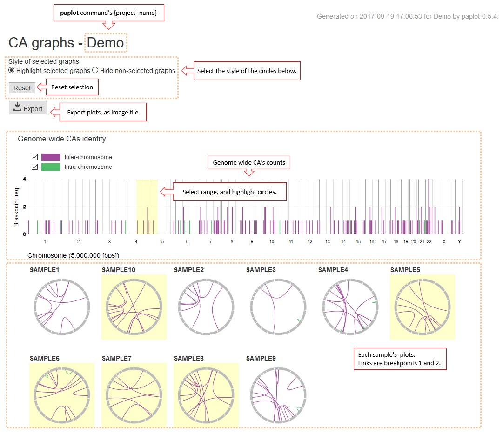
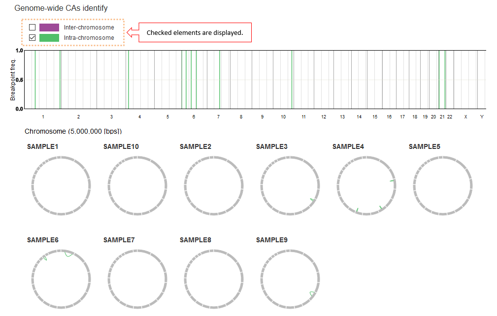
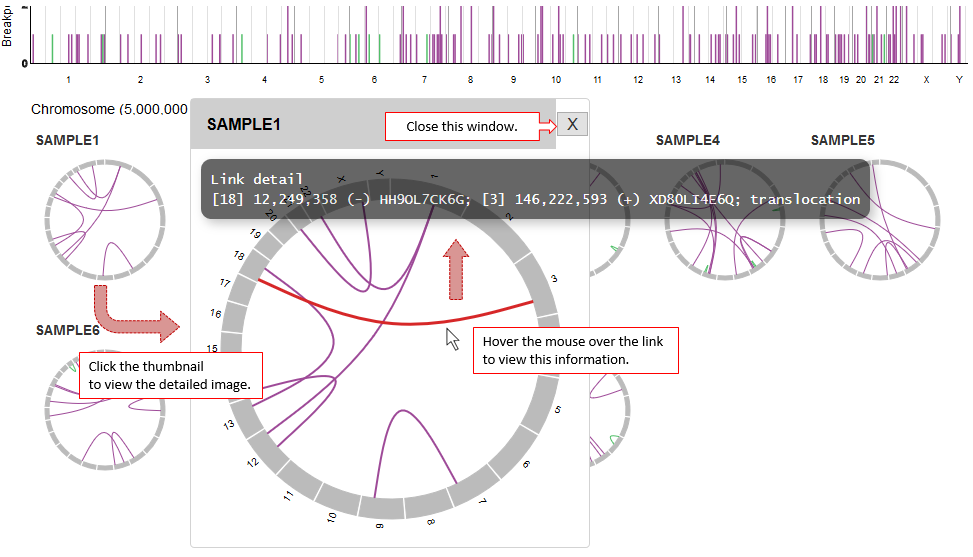

==========================================
Chromosomal Aberration (CA) Report
==========================================

| CA Report displays a landscape of chromosomal aberrations, such as structural variations (typically identified by genome sequence data) and gene fusions (by transcriptome sequence data).

* The barplot at the top panel displays the distribution of the breakpoints of the CAs in the cohort.
* The circular plots below illustrate the `CIRCOS-like <http://circos.ca>`_ profile of the CAs for each sample, where two edges of a curved line represent the breakpoints of each CA.

| When you select a region in the barplot at the top, samples having any of the breakpoints in the selected region are highlighted (when Style of selected graphs are set to "Highlight selected graphs") or the samples without any of the breakpoints in the region disappears ("Hide non-selected graphs").

| In the default setting, CAs are categorized as Inter-chromosome (two breakpoints are on different chromosomes) or Intra-chromosome (two breakpoints are on the same chromosome).  [*]_  If you uncheck any of the groups, the CAs within the group will disappear.

.. [*] About categorization

  By using the configuration file, the categorization can be changed. 
  Please refer to `Customizing categorization <./data_ca.html#ca-group>`_ .

  

| Click on the circle graph for each sample to enlarge it.
| View the details by hovering the mouse over the lines connecting the breakpoints.

