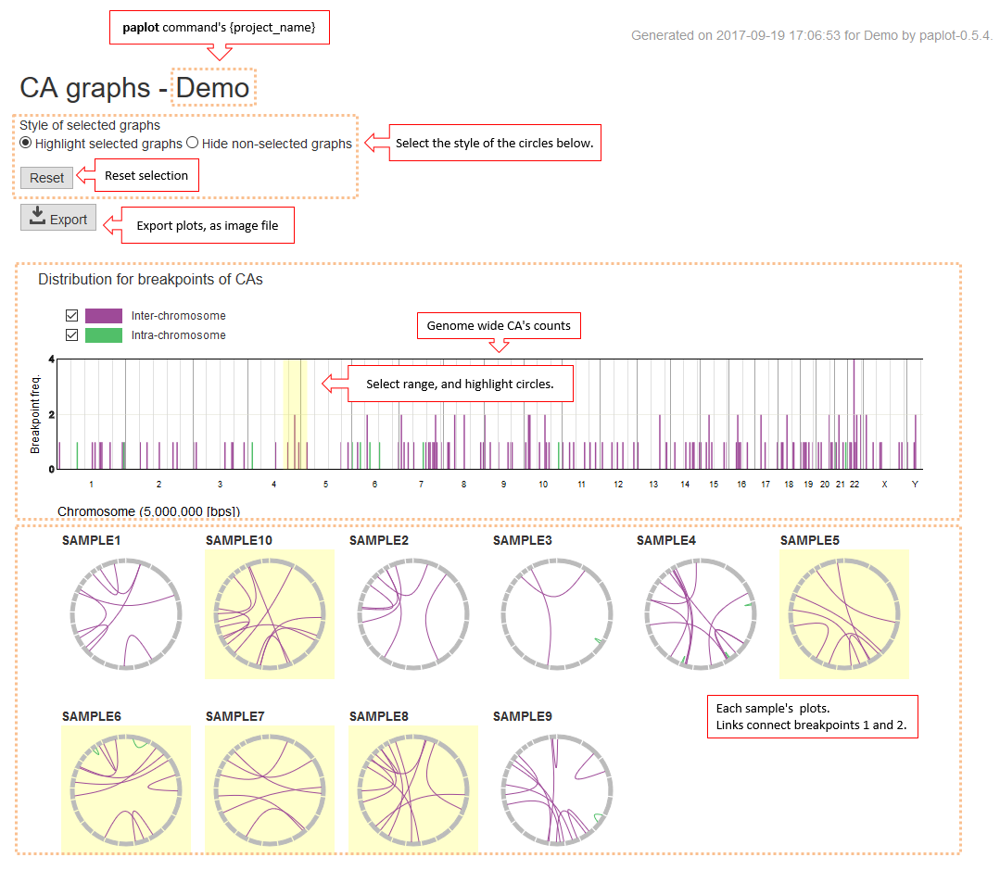

==========================================
Chromosomal Aberration Report
==========================================

| CA (Chromosomal Aberration) Report displays a landscape of chromosomal aberrations such as structural variations (typically identified by genome sequence data) and gene fusions (by transcriptome sequence data).

* Barplot at the top panel shows the distribution for breakpoints of CAs in the cohort.
* The circular plots below shows the `CIRCOS-like <http://circos.ca>`_ profile of CAs for each sample, where two edges of a curved line represent the breakpoints of each CA.

| When you select a region in the barplot at the top, samples having any of the breakpoints in the selected region are highlighted (when Style of selected graphs are set to "Highligh selected graphs") or samples without any of the breakpoints in the region dissapears ("Hide non-selected graphs).

| In the default setting, CAs are categorized into Inter Chromosome (two breakpoints are on the different chromosome) and Intra Chromosome (two breakpoint are on the same chromosome).  [*]_  If you unckeck any of the groups, then CAs within the group will disappear.

.. [*] About categorization

  By using the configuration file, categorization can be changed. 
  Please refer to `Customizing categorization <./data_ca.html#ca-group>`_ .

  
.. image:: image/sv_operation2.PNG
  :scale: 100%

| Click the circle graph for each sample to enlarge it.
| Show the details by hovering the mouse over lines connecting the breakpoints.

.. image:: image/sv_operation3.PNG
  :scale: 100%
