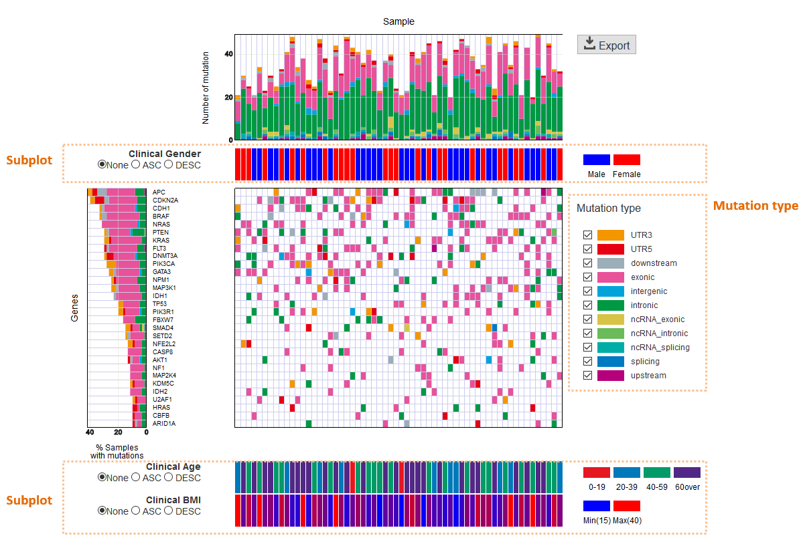
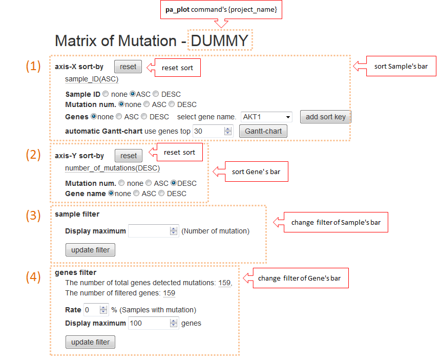
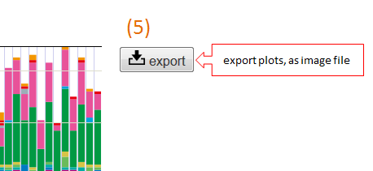
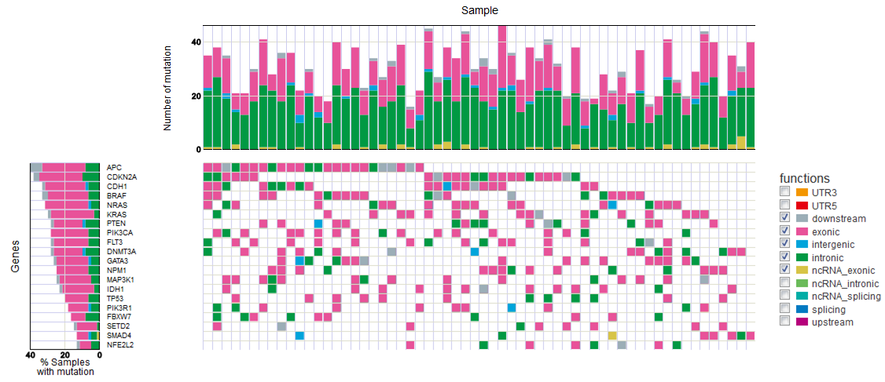
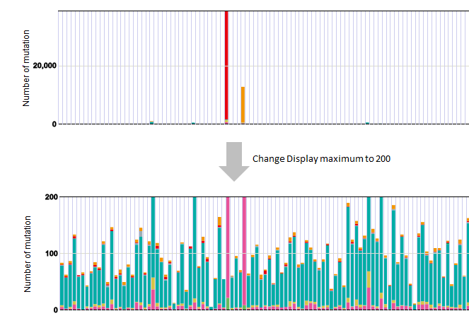

========================
mutation-matrix graph
========================

In the mutation-matrix graph, the mutated type is displayed with the vertical axis as the gene (Gene) and the horizontal axis as the sample (Sample) for the detected mutation.

:Horizontal bar chart (Sample):
  Displays the number of mutations detected for each sample.

:Vertical bar chart (Gene):
  Displays the number of mutations for each gene as a percentage of the number of samples.

  - If the same sample has multiple mutations for the same gene, count the number of mutations as 1.
  - If the same sample has multiple mutation types for the same gene, count it as a mutation type with a higher priority.
  
:functions:
  Mutation type (func) is displayed separately color-coded. If there are mutation types that you do not want to display, you can exclude them by unchecking the checkbox of functions.
  
:sub plot:
  If there is data for the sample separately from mutation, it can be displayed as subplot. This file must be entered in the configuration file before executing the ``paplot`` command.

**Method of operation**

1. axis-X sort 
---------------

Change the order of the horizontal axis.

 - none ... Do not sort
 - ASC ... ascending order
 - DESC ... descending order

It can sort by the following elements, and it can sort multiple.

:SampleID: Sort by name of sample
:Mutation num.: Number of mutations per sample
:Genes: Number of mutations per gene. After selecting either ASC/DESC, select the Gene name from the list box next to it and click the [add sort key] button.
:automatic Gantt-chart:
  We will create a Gantt chart automatically.
  Enter the number of genes to use in the horizontal edit box and click the [Gantt-chart] button.
  What is Gantt-chart? (It is not a general meaning.)

**Gantt-chart**

| Place the ordinate in descending order of the number of mutations of genes (Gene), and sort the abscissa according to whether or not the mutation of that gene is possessed.
| First, arrange from the top gene and repeat as many as the number of genes specified.
| It is ideal to repeat as many times as the number of detected genes, but as processing becomes heavier, processing will be faster if you narrow down to the gene of interest.
|

2. axis-Y sort
----------------

Change the order of the vertical axis.

 - none ... Do not sort
 - ASC ... ascending order
 - DESC ... descending order

It can sort by the following elements, and it can sort multiple.

:Mutation num.: Number of mutations per gene
:Gene name: Sorted by gene name

3. sample filter
------------------

| Sets the maximum value of the vertical axis of the horizontal bar chart (Sample).
|
| In some cases where only a few samples jump out and the number of mutations is large and others are not so mutated, using this function may make the graph easier to see.
| Enter the maximum value you want to display in the horizontal edit box, then click the [update filter] button.
| If it is left blank, it will show everything. (initial value)
| 

**Before and after filter application**

| Example of display when maximum value is set to 200.
| 

4. genes filter
-----------------

Set the filter for the gene displayed on the vertical axis.

:Rate: Percentage of the number of samples of the detected genes (%). The initial value is 0% (no filtering)
:Display maximum: Maximum number of genes to display.

After inputting to both sides in the edit box, please click the [update filter] button.
