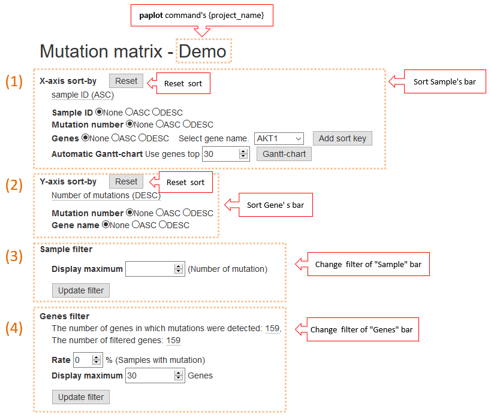
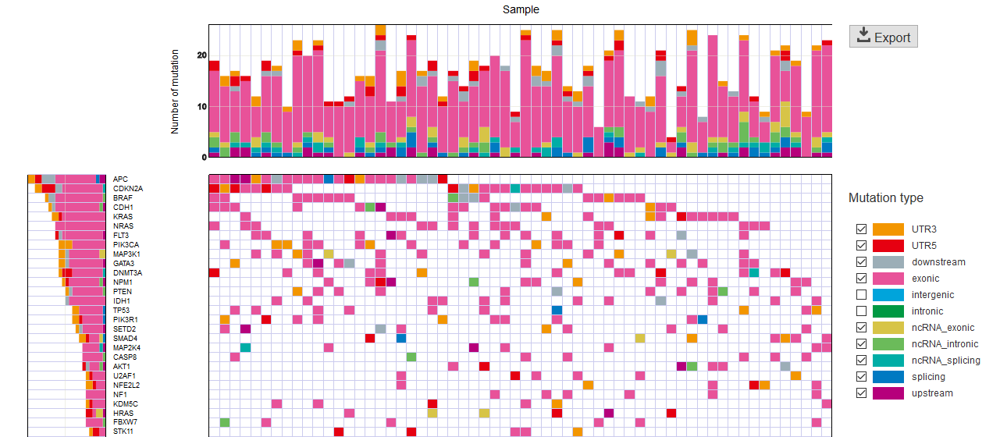

===========================
Mutation Matrix Report
===========================

Mutation Matrix Report displays a landscape of mutation status across genes (vertical axis) and samples (horizontal axis).

:Horizontal bar chart (Sample):
  | Displays the total number of mutations detected for each sample.

:Vertical bar chart (Gene):
  | Displays the number of mutations and fractions of mutation types (e.g., nonsynonymous, stopgain, etc.) for each gene.
  |
  | - If the same sample has multiple mutations on the same gene, this is counted as 1.
  | - If the same sample has multiple mutations with different mutation types on the same gene, a mutation type with "the higher priority" is counted. For example, in the default setting, the priority of stopgain is higher than that of nonsynonymous mutations. The order of priority can be modified by the configuration file. 

:Mutation type:
  | The mutation type is displayed with a distinct color. If you wish to hide a specific type of mutations, uncheck them in this section.

:Subplot:
  | If meta information is available for the samples (e.g., clinical information), it can be displayed as a subplot. This file must be entered in the configuration file before executing the paplot command.

.. image:: image/mut_operation1.PNG
  :scale: 100%

**How to view**

.. image:: image/mut_operation2_2.PNG
  :scale: 100%

1. X-axis sort
---------------

Change the order of items on the horizontal axis:

 - None ... Default order
 - ASC ... Ascending order
 - DESC ... Descending order

It can sort based on the following elements (allowing for multiple key ordering):

:Sample ID:
  | Sort by sample name.

:Mutation number:
  | Sort by the number of mutations per sample.

:Genes:
  | Sort by the mutation states of the selected genes. After selecting either ASC or DESC, select the gene to add from the [Select gene name] list box, and click the [Add sort key] button.

:Automatic Gantt-chart:
  | A Gantt chart can be automatically created. Enter the number of genes to display [*]_ in the horizontal edit box, and click the [Gantt-chart] button.

**How Gantt-chart a Generated**

 1. First, sort the genes according to the descending order to number of mutations.
 2. Then, divide the samples into two groups according to the mutation status of the first gene, and place the group with the mutation to the left and the other group to the right.
    Repeat this procedure for the second one, third one, etc.

.. [*]
   It is preferable to display all the detected genes. However, as processing becomes heavier. In numerous cases, narrowing down to the gene list will be practical.

2. Y-axis sort
----------------

Change the order of items on the vertical axis.

 - None ... Default order
 - ASC ... Ascending order
 - DESC ... Descending order

It can sort based only the following elements (allowing for multiple key ordering):

:Mutation number: Sort by number of mutations per gene.
:Gene name: Sort by gene name.

3. Sample filter
------------------

Sets the maximum value of the vertical axis of the horizontal bar chart.

| In certain cases, only a few samples exhibit remarkably large numbers of mutations compared to the others.
| In those cases, setting the threshold for the maximum number of mutations will render the graph significantly more convenient to view.
| Enter the threshold value in the horizontal edit box. Then, click the [Update filter] button.
| In the default setting ("blank"), the maximum of the horizontal axis is automatically set to the maximum number of mutations among the samples in the cohort.

**Before and after filter application**

| Example of display when maximum value is set to 200:
| 

.. image:: image/mut_operation4.PNG
  :scale: 100%

4. Genes filter
-----------------

Set the filter for the gene displayed on the vertical axis.

:Rate:
  | Frequency of the samples with mutations at each gene (%). The initial value is 0% (no filtering)

:Display maximum:
  | Maximum number of genes to display.

After setting the above items, please click the [update filter] button.

