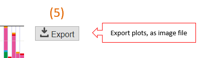

========================
Mutation-matrix graph
========================

In the mutation-matrix graph, 
the mutation status for each gene (Gene, the vertical axis) and samples (Sample, the horizontal axis) is displayed.

:Horizontal bar chart (Sample):
  Displays the total number of mutations detected for each sample.

:Vertical bar chart (Gene):
  Displays the fraction of samples with the mutations affecting each gene stratified by types of mutations (e.g., nonsynonymous, stopgain and so on).

  - If the same sample has multiple mutations at the same gene, this is counted as 1.
  - If the same sample has multiple different types of mutation at the same gene, just a mutation type with "the higher priority" is counted. For example, the priority of stopgain is higher than that of nonsynonymous mutations. Please see (XXX) for the default settings of the priority and (XXX) for modifying them.
  
:functions:
  Mutation type (function) is displayed with a distinct color. If you want to hide a specific type of mutations, uncheck the item in this section.
  
:sub plot:
  If there is meta infromation for the samples (e.g., clinical information), it can be displayed as subplot. This file must be entered in the configuration file before executing the ``paplot`` command.

.. image:: image/mut_operation1.PNG
  :scale: 100%

**Method of operation**

.. image:: image/mut_operation2.PNG
  :scale: 100%

1. Axis-X sort 
---------------

Change the order of the horizontal axis.

 - none ... Default order
 - ASC ... Ascending order
 - DESC ... Descending order

It can sort by the following elements (allowing for multiple key ordering):

:SampleID: Sort by the name of samples
:Mutation num.: Number of mutations per sample
:Genes: Number of mutations per gene. After selecting either ASC/DESC, select the Gene name from the list box next to it and click the [add sort key] button.
:automatic Gantt-chart:
  We will create a Gantt chart automatically.
  Enter the number of genes to use in the horizontal edit box and click the [Gantt-chart] button.
  What is Gantt-chart? (It is not a general meaning.)

**Gantt-chart**

| Place the ordinate in descending order of the number of mutations of genes (Gene), and sort the abscissa according to whether or not the mutation of that gene is possessed.
| First, arrange from the top gene and repeat as many as the number of genes specified.
| It is ideal to repeat as many times as the number of detected genes, but as processing becomes heavier, processing will be faster if you narrow down to the gene of interest.
|

.. image:: image/mut_operation3.PNG
  :scale: 100%

2. Axis-Y sort
----------------

Change the order of the vertical axis.

 - none ... Default ordering
 - ASC ... Ascending order
 - DESC ... Descending order

It can sort by the following elements (allowing for multiple key ordering):

:Mutation num.: Number of mutations per gene
:Gene name: Sorted by gene name

3. Highly-mutated sample filter
------------------

| Sets the maximum value of the vertical axis of the horizontal bar chart (Sample).
|
| In some cases where only a few samples have extremely large numbers of mutations compared to others, setting the threshould for the maximum number of mutations will make the graph a lot easier to see. 
| Enter the threshould value in the horizontal edit box, then click the [update filter] button.
| In the default setting ("blank"), the maximum of the horizontal axis is set to the maximum number of mutations by a sampleautomatically.
| 

**Before and after filter application**

| Example of display when maximum value is set to 200.
| 

.. image:: image/mut_operation4.PNG
  :scale: 100%

4. genes filter
-----------------

Set the filter for the gene displayed on the vertical axis.

:Rate: Frequency of the samples with mutations at each gene (%). The initial value is 0% (no filtering)
:Display maximum: Maximum number of genes to display.

After inputting to both sides in the edit box, please click the [update filter] button.
