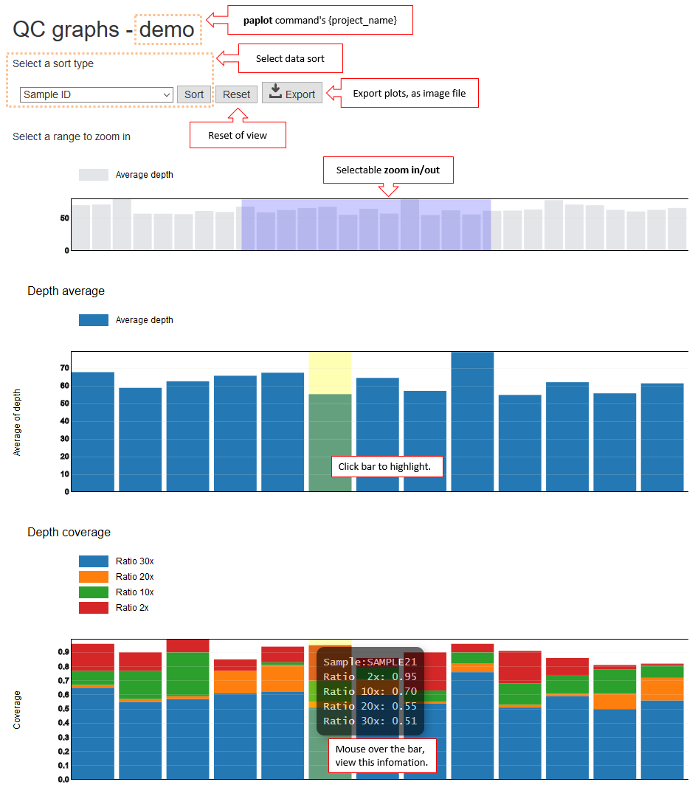

==============
QC graph
==============

| QC (Quality Control) graph reports each bam's quality.
|
| Shorty graph of top, plots the depth average value of each bam file.
| You can expand the other graph by range selection this graph.
| On mouse to each graph, to view the details.
|

.. |new| image:: image/tab_001.gif
