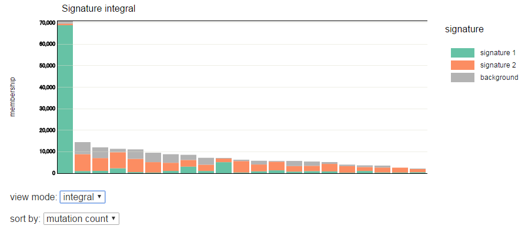

========================
Signature graph |new|
========================

In the signature graph, so called "mutation signature" (see e.g., Alexandrov et al., Nature, 2013) are displayed as bargraphs, and estimated "contributions" of each signature to the mutations per samples are shown by a stacked bar graphs.

:signature:
  Display signature.

:Stacked graph:
  For each sample, the ratio of signature is displayed for mutation.

.. image:: image/sig_dummy.PNG
  :scale: 100%

In addition, you can switch the display mode by the list box below the stacked graph.

:view mode:
  - rate ... The percentage (%) of signature contribution normalized by sum-to-one constraint.
  - integral ... It shows the ratio by the actual number of mutation.

:sort by:
  - sampleID ... Sort by sample ID
  - mutation count ... Descending order of mutations

  Only when view mode is integral, you can select the sorting method.

Display example when view mode is "integral" and sort by "mutation count".

The same is true for pmsignature.

.. image:: image/pmsig_dummy.PNG
  :scale: 100%

.. |new| image:: image/tab_001.gif
