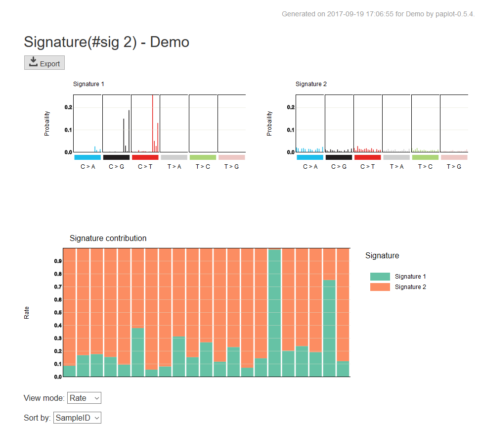
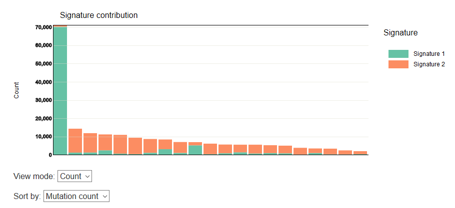

=============================
Mutaitonal Signature Report
=============================

Mutaitonal Signature Report displayes so called "mutation signature" (see e.g., Alexandrov et al., Nature, 2013) as bargraphs, and estimated "contributions" of each signature to the mutations per samples as stacked bar graphs.

:Upper panel (mutation signature graph):
  | Mutation signature are displayed (typically by barplots with 96 elements).

:Lower panel (signature contribution graph):
  | For each sample, the ratios of contributions of mutation signatures to the mutations are displayed

In addition, you can switch the display mode by the list box below the stacked graph.

:View mode:
  :Rate: The percentage (%) of signature contribution normalized by sum-to-one constraint.
  :Count: It shows the ratio by the actual number of mutation.

:Sort by:
  :Sample ID: Sort by sample ID
  :Mutation count: Descending order of mutations (applicable only when view mode is Count).

Display example when view mode is [Count] and sort by [Mutation count].

Similar representation is adopted for the case with pmsignature.

.. image:: image/pmsig_dummy.PNG
  :scale: 100%

.. |new| image:: image/tab_001.gif
