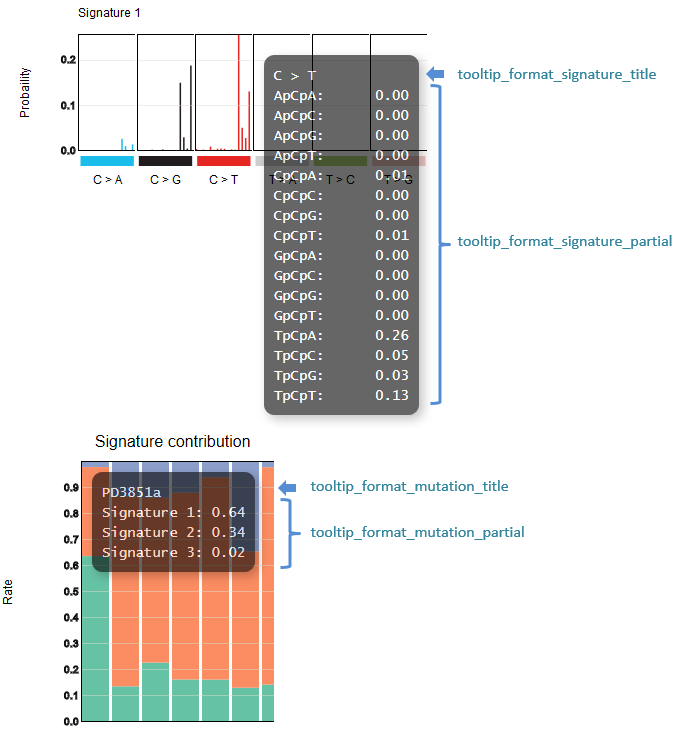
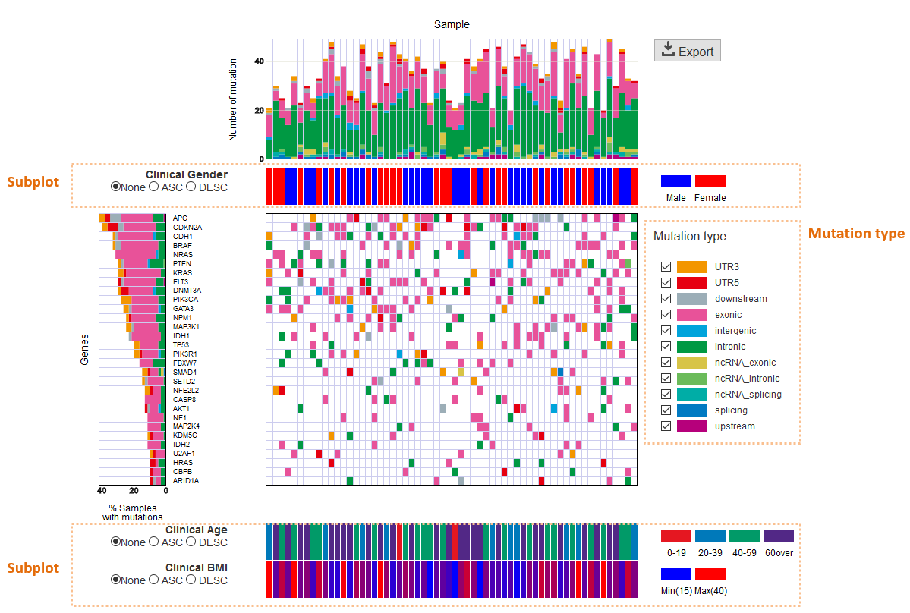
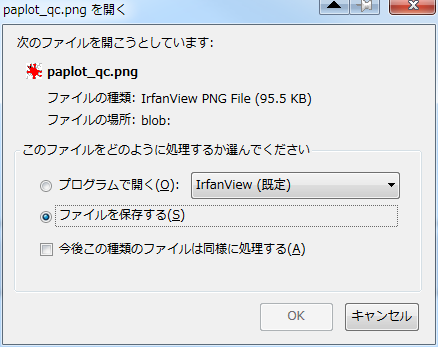
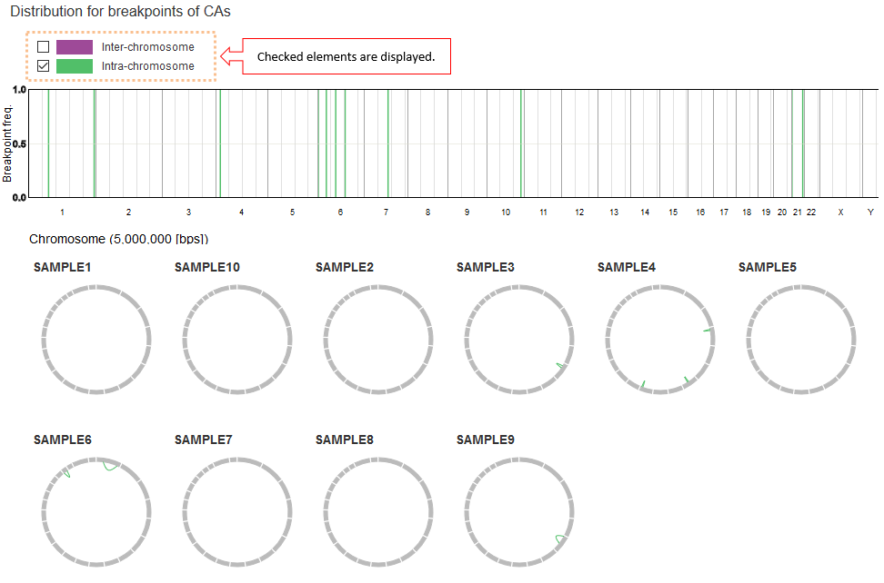

.. image:: https://img.shields.io/badge/python-2.7-blue.svg
    :target: https://img.shields.io/badge/python-2.7-blue.svg
.. image:: https://img.shields.io/badge/python-3.5-blue.svg
    :target: https://img.shields.io/badge/python-3.5-blue.svg

.. image:: image/genomon_kun.PNG

paplot documentation
========================

Contents:

.. toctree:: 
   :maxdepth: 2
   :caption: quick start
   :name: quick_start_toc
   
   about.rst
   quick_start.rst

.. toctree:: 
   :maxdepth: 2
   :caption: how to use graphs
   :name: how_to_toc
   
   howto_qc.rst
   howto_ca.rst
   howto_mat.rst
   howto_signature.rst

.. toctree:: 
   :maxdepth: 2
   :caption: install & setting
   :name: install_toc
   
   install.rst
   config.rst
   genomon.rst
   command.rst

.. toctree:: 
   :maxdepth: 2
   :caption: for advance
   :name: advance_toc
   
   config_qc.rst
   config_ca.rst
   config_mat.rst
   config_signature.rst
   config_pmsignature.rst
   exec_signature.rst
   exec_pmsignature.rst
   style.rst

.. toctree:: 
   :maxdepth: 1
   :caption: Q & A
   :name: qa_toc
   
   qa.rst

.. toctree:: 
   :maxdepth: 1
   :caption: infomation
   :name: info_toc
   
   info.rst
   
Javascript Libraries
====================

Paplot uses the following javascript package.

* `D3.js <https://d3js.org/>`_
* `d3-legend <http://d3-legend.susielu.com>`_

.. |new| image:: image/tab_001.gif

.. |id001| image:: image/col_pos.PNG
.. |id002| image:: image/conf_mut1.PNG
.. |id003| image:: image/conf_mut2.PNG
.. |id004| image:: image/conf_mut3.PNG
.. |id005| image:: image/conf_mut4.PNG
.. |id006| image:: image/conf_pmsig1.PNG
.. |id007| image:: image/conf_qc1.PNG
.. |id008| image:: image/conf_qc2.PNG
.. |id009| image:: image/conf_qc3.PNG
.. |id010| image:: image/conf_qc4.PNG

.. |id012| image:: image/default_color.PNG
.. |id013| image:: image/exec_pmsig1.PNG
.. |id014| image:: image/genomon_kun.PNG
.. |id015| image:: image/id_suffix.PNG
.. |id016| image:: image/link-opacity.PNG
.. |id017| image:: image/mut_dummy.PNG

.. |id019| image:: image/mut_operation2.PNG
.. |id020| image:: image/mut_operation2_2.PNG
.. |id021| image:: image/mut_operation3.PNG
.. |id022| image:: image/mut_operation4.PNG
.. |id023| image:: image/mutation_list.PNG
.. |id024| image:: image/option_sv.PNG
.. |id025| image:: image/pmsig_dummy.PNG

.. |id028| image:: image/qa_export2.PNG
.. |id029| image:: image/qa_genome_size.PNG
.. |id030| image:: image/qc_dummy.PNG
.. |id031| image:: image/qc_operation.PNG
.. |id032| image:: image/sig_dummy.PNG
.. |id033| image:: image/sig_operation1.PNG
.. |id034| image:: image/sv_dummy.PNG
.. |id035| image:: image/sv_operation1.PNG

.. |id037| image:: image/sv_operation3.PNG
.. |id038| image:: image/tab_001.gif

