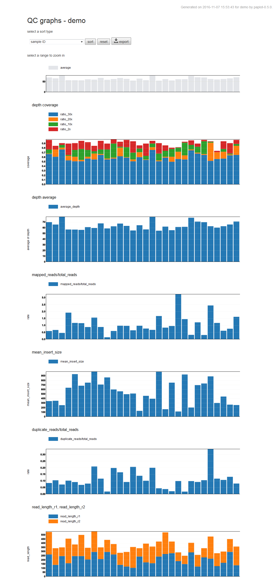
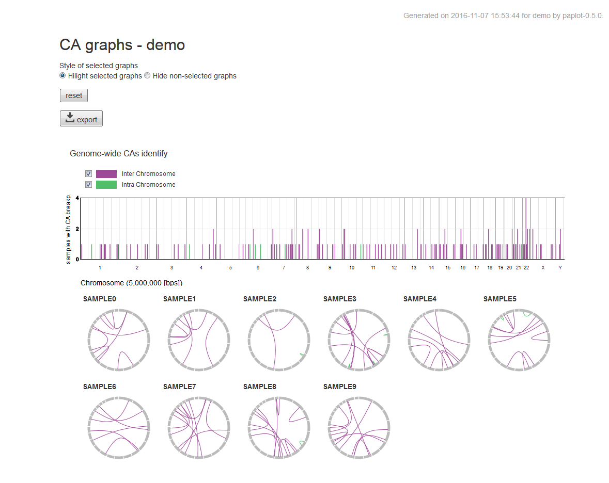

=================
Dependency
=================

 - python >= 2.7

Required web browser for viewing result file.
(Tested in the following)

 - Firefox 48
 - Google Chrome 44
 - Internet Explorer 11

=================
Install
=================

.. code-block:: bash

    git clone https://github.com/Genomon-Project/paplot.git
    cd paplot

    python setup.py build install --user

=================
run with test data
=================

.. code-block:: bash

    cd {paplot installed directory}

    # create bar graphs of qc
    pa_plot qc "example/qc/*.csv" ~/tmp DUMMY --config_file example/example.cfg

    # create bundle graphs of Structural Variation (SV)
    pa_plot sv "example/sv/*.txt" ~/tmp DUMMY --config_file example/example.cfg

open two HTML files with web browser

.. code-block:: bash

    {output_dir}/DUMMY/graph_sv.html
    {output_dir}/DUMMY/graph_qc.html

Can you see following charts?

