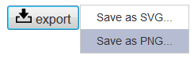
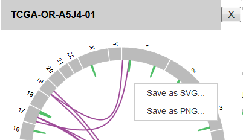

***************************
about install
***************************

Error in ``paplot conf``
---------------------------

| It occurs when `` PATH`` or `` LD_LIBRARY_PATH`` setting is insufficient.
| Refer to :doc:`install`.
|
| In case of such an error, the setting of ``PATH`` is incorrect.

.. code-block:: bash

  $ paplot conf
  -bash: /usr/bin/paplot: No such file or directory

| In case of such an error, the setting of ``LD_LIBRARY_PATH`` is incorrect.

.. code-block:: bash

  $ paplot conf
  Traceback (most recent call last):
    File "/usr/bin/paplot", line 4, in <module>
      __import__('pkg_resources').run_script('paplot===0.2.7devel', 'paplot')
  (省略)
  pkg_resources.DistributionNotFound: The 'paplot===0.2.7devel' distribution was not found and is required by the application

| If there is no ``paplot`` file, the installation may not be successful.
| In the case of success, the last three lines are displayed like this.
| (The number in paplot-0.2.7 varies with version.)
|

.. code-block:: bash

  $ python setup.py build install

  (Last 3 rows)
  Installed /usr/lib/python2.7/site-packages/paplot-0.2.7devel-py2.7.egg
  Processing dependencies for paplot===0.2.7devel
  Finished processing dependencies for paplot===0.2.7devel

***************************
about graphs
***************************

Want to save a graph as an image.
---------------------------------------------

| Image storage function has been added since v0.4.0.
| Click the "export" button in each plot.
| The menu will be displayed, so select the desired format, either SVG or PNG.
|

| Output format
|

 - SVG ... It is a text file described by tag. In addition to SVG compatible image editing software, it can display with various browsers.
 - PNG ... It is a general image file. Background Transparent processing is applied.
 
| If you only want to save 1 plot, you can save it by right clicking on each plot.
|

.. note::

  This function is confirmed with the following browsers. If it does not work, update to the latest version or try another browser.
  
  + Windows
  
    - Firefox (47.0)
    - Chrome (51.0)
    - Internet Explorer11 (11.0)
   
  + Mac
   
    - Firefox (45.2)
    - Chrome (52.0)
    - Safari (9.1.2)

For Chrome
+++++++++++++++++++++++++++

After format selection, it will be downloaded automatically.

For Firefox
+++++++++++++++++++++++++++

After selecting the format, a message about downloading will be displayed, please save it in an arbitrary place.

.. image:: image/qa_export_firefox.PNG

For IE
+++++++++++++++++++++++++++

 - SVG ... After selecting the format, the download screen will be displayed, please save it in an arbitrary place.
 - PNG ... Since the image is displayed in a new tab, right click and select "Save image as ...".

For Safari
+++++++++++++++++++++++++++

 - SVG ... Since the image is displayed in a new tab, right click and select "Save page as another name ...".

 | Please specify each item as follows.
 |   Output name「{name}.svg」
 |   Format「Source of the page」
 |
 
 - PNG ... As the image is displayed in a new tab, right click and select "Save Image As ...".

| ※If the new tab does not open, please check the following settings.
|   Safari → Envairoment → Security → Web Contents → uncheck "Don't open pop-up window"
|

*********************************
with GenomonPipeline
*********************************

Mutation matrix is ​​not displayed
-------------------------------------------

It is not displayed if annovar setting is OFF.（Because we can not acquire Gene information and function information）
Please check the Genomon configuration file.

.. code-block:: cfg

  [annotation] active_annovar_flag = False

.. |new| image:: image/tab_001.gif
