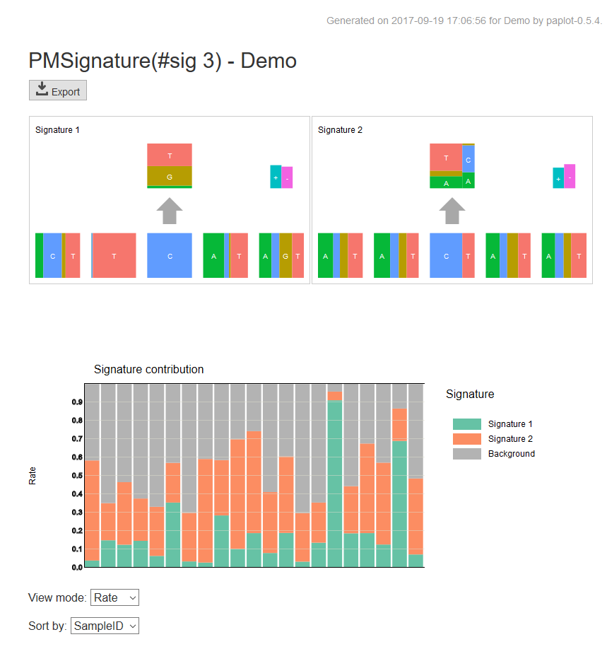

*****************
Quick Start
*****************

In this section, we will learn to

#. Install paplot
#. Execute paplot with simple example data
#. View the output reports
#. Modify configuration files and use your own data.
 

1. Install paplot
---------------------------

| paplot is confirmed to work on Python2.7 and Python 3.5.
| At present, paplot requires only standard packages.

.. code-block:: bash

  cd {the directory where you want to install paplot}
  # for v0.5.4
  wget https://github.com/Genomon-Project/paplot/archive/v0.5.4.zip
  unzip v0.5.4.zip
  cd paplot-0.5.4/

  python setup.py build install

**Confirmation of installation**

| Execute the following command.

.. code-block:: bash

  paplot --version

| If the following messages appears, the installation is successful.

.. code-block:: bash

  paplot-0.5.4

| For more detailed information on installation, please consult :doc:`install`. 

2. Execute paplot with simple example data
-------------------------------------------------------

| The basic commands of paplot are as follows: 
| For the description of detailed options, please consult :doc:`command`.

.. code-block:: bash

  paplot subcommand [--config_file CONFIG_FILE] [--title TITLE]
                    [--ellipsis ELLIPSIS] [--overview OVERVIEW]
                    [--remarks REMARKS]
                    input output_dir project_name

|

**Required arguments**

:subcommand:
  The type of report to generate. Select from the following:
  
  - qc
  - ca
  - mutation
  - signature
  - pmsignature

:input:
  The input data table.

:output_dir:
  The directory wherein the output files of paplot are generated.

:project_name:
  The project name (used as the title of the output files).

Please execute paplot using the prepared sample data.

.. code-block:: bash

  cd {the path where paplot is installed}

  # QC Report
  paplot qc example/qc_brush/data.csv ./tmp demo

  # Chromosomal Aberration Report
  paplot ca example/ca_option/data.csv ./tmp demo

  # Mutation Matrix Report
  paplot mutation example/mutation_option/data.csv ./tmp demo

  # Mutational Signature Report 
  paplot signature "example/signature_stack/data*.json" ./tmp demo

  # pmsignature Report 
  paplot pmsignature "example/pmsignature_stack/data*.json" ./tmp demo

3. View the output file
------------------------

You will find the following directory structure:

.. code-block:: bash

  The directory specified by the {output_dir} argument
    ├ demo
    │   ├ graph_ca.html            <--- Chromosomal Aberration Report 
    │   ├ graph_mut.html           <--- Mutation Matrix Report 
    │   ├ graph_pmsignature2.html  <--- pmsignature Report (with varying number of mutation signatures)
    │   ├ graph_pmsignature3.html
    │   ├ graph_pmsignature4.html
    │   ├ graph_pmsignature5.html
    │   ├ graph_pmsignature6.html
    │   ├ graph_qc.html            <--- QC Report 
    │   ├ graph_signature2.html    <--- Mutational Signature Report (with varying number of mutation signatures)
    │   ├ graph_signature3.html
    │   ├ graph_signature4.html
    │   ├ graph_signature5.html
    │   └ graph_signature6.html
    │
    ├ js          <--- The next four directories are necessary to display HTML files, Do not remove them.
    ├ layout
    ├ lib
    ├ style
    │
    └ index.html             <--- Open this file in a web browser.

| Open `index.html` file in a web browser, and you will find the following reports.
|

| **QC Report**

.. image:: image/qc_dummy.PNG
  :scale: 100%

| **Chromosomal Aberration Report**

.. image:: image/sv_dummy.PNG
  :scale: 100%

| **Mutation Matrix Report**

.. image:: image/mut_dummy.PNG
  :scale: 100%

| **Mutational Signature Report**

.. image:: image/sig_dummy.PNG
  :scale: 100%

| **pmsignature Report**

| For how to interpret each graph, please refer to `HOW TO USE GRAPHS <./index.html#how-to-toc>`_.

**Modify configuration files and use your own data**

| Please consult the following links to set up your own data and configuration files.
| 
| [For basic use]

 - :doc:`data_qc` 
 - :doc:`data_ca` 
 - :doc:`data_mat` 
 - :doc:`data_signature` 
 - :doc:`data_pmsignature` 

.. |new| image:: image/tab_001.gif
