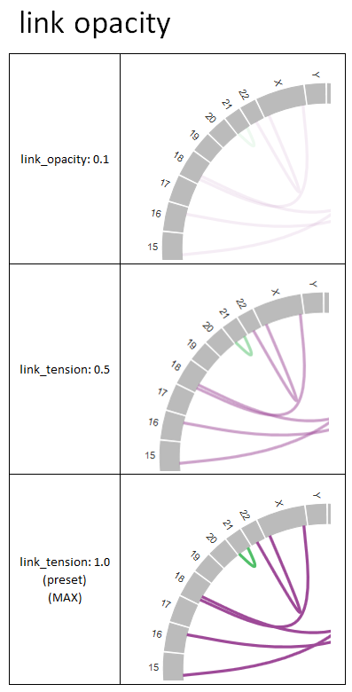

***************************
Customize graph
***************************

1. How to change
=======================

| The appearance of graphs such as colors and text can be changed to some extent.
| The appearance of the graph is set with two files.
| 
| The first is the **config** file.
| Elements that depend on input data (such as the color and legend of the graph's bar and the character string of the popup window) are set in the config file.
| For an example of config file entry please refer to the following.
|

 - :doc:`config`
 - :doc:`config_qc` 
 - :doc:`config_ca` 
 - :doc:`config_mat` 
 - :doc:`config_signature` 
 - :doc:`config_pmsignature` 

| The second is the **style** file.
| Set elements that do not depend on input data.
| Here, we describe the style file.
|

1-1. Edit style file
---------------------------------

Here is the default style file.

``{path to the paplot installed directory}/example/default.js``

Copy this file and create a new style file.

Here we create it as an example. ``{path to the paplot installed directory}/example/mystyle.js``

* The file name is arbitrary, but please make sure the extension is ``.js``.

Open the modified file and change it.

.. note::

  Color can be specified by RGB or color name.
  
  .. code-block:: javascript
  
    // specifying with RGB
    bar_select_color: "#1F77B4",
    // specifying by color name
    bar_select_color: "red",
  
  **When specifying with RGB**
  
  | Specify Red → Green → Blue in hexadecimal notation in order, followed by ``#`` at the beginning.
  
  **About color name***
  
  | It is called UNIX X11 color and has a name of 140 colors to make it easy to understand.
  | If it is a color name defined here, it can be specified instead of the RGB value.
  | 
  | https://www.w3.org/TR/css3-color/#svg-color
  

1-2. Edit configuration file
---------------------------------

Change the config file to use the style file created this time.

``{path to the paplot installed directory}/example/example.cfg``

Open this file and change the following:

.. code-block:: cfg

  [style]
  path = {path to the paplot installed directory}/example/mystyle.js
  
  # When paplot is installed in ~/tmp, write like this
  # ~/tmp/paplot/example/mystyle.js

1-3. Run paplot
---------------------

.. code-block:: bash

  cd {path to the paplot installed directory}
  paplot qc "example/qc/*.csv" ./tmp style_test --config_file example/example.cfg

1-4. Change the output file
--------------------------------------

The file created above is copied to the following directory.

If you change the HTML file already output by paplot, it will be reflected if you edit the style file (mystyle.js) and reload it (``F5`` on the browser).

.. code-block:: bash

  ./tmp
    ├ style_test
    │   └ graph_qc.html
    │
    ├ js
    ├ layout
    ├ lib
    └ style
        ├ default.js     <--- default file
        └ mystyle.js     <--- created file

2. Setting items
=======================

.. code-block:: javascript

  (function(){
  style_general = {
      font_family: "'Helvetica Neue', Helvetica, Arial, sans-serif",
  }
  
  // style of quality check graphs
  style_qc = {
      brush_border_y_color: "#DDDDCC",
      brush_border_y_opacity: 0.5,
      plot_border_y_color: "#DDDDCC",
      plot_border_y_opacity: 0.2,
      title_y_font_size: "12px",
      legend_title_font_size: "16px",
      legend_text_font_size: "12px",
  };
  
  // style of genome-wide bar plot
  style_sv_bar = {
      // title's text options
      title_y: "samples with CA breakp.",
      title_y_font_size: "12px",
  
      title_x: "Chromosome",
      title_x_font_size: "14px",
      
      legend_title: "Genome-wide CAs identify",
      legend_title_font_size: "16px",
      legend_text_font_size: "12px",
      
      border_x_main_color: "#E0E0E0",
      border_x_main_width: "1px",
      border_x_sub_color: "#A6A6A6",
      border_x_sub_width: "1px",
      border_y_color: "#DDDDCC",
      border_y_opacity: 0.5,
      
      axis_x_font_size: "9px",
  };
  
  // style of thumbnails
  style_sv_thumb = {
      // circular sector's color options
      arc_fill_opacity: 1.0,
      arc_stroke_opacity: 1.0,
      
      // link options
      link_width: "1px",
      link_opacity: 1.0,
  };
  
  // style of detail image (on click)
  style_sv_detail = {
      // windows header
      win_header_text_color: "#000000",
      win_header_background_color: "#CFCFCF",
      win_border_color: "#D3D3D3",
      win_border_width: "1px",
      win_background_color: "white",
      
      // circular sector's color options
      arc_fill_opacity: 1.0,
      arc_stroke_opacity: 1.0,
      
      // circular sector's label options
      arc_label_fontsize: "10px",
      arc_label_color: "#333333",
      
      // link options
      link_width: "2px",
      link_opacity: 1.0,
      
      // link(on mouse) options
      link_select_color: "#d62728",
      link_select_width: "3px",
      link_select_opacity: 1.0,
  };
  
  // style of mutaion-matrix
  style_mut = {
      // title's text options
      title_sample: "Sample",
      title_sample_font_size: "14px",
      title_sample_y: "Number of mutation",
      title_sample_y_font_size: "12px",
      virtical_border_x_color: "#CCCCEE",
      virtical_border_x_width: "1px",
      virtical_border_y_color: "#DDDDCC",
      virtical_border_y_opacity: 0.5,
      
      title_gene: "Genes",
      title_gene_font_size: "14px",
      title_gene_y1: "% Samples",
      title_gene_y2: "with mutationg",
      title_gene_y1_font_size: "12px",
      title_gene_y2_font_size: "12px",
      horizon_border_x_color: "#CCCCEE",
      horizon_border_x_width: "1px",
      horizon_border_y_color: "#DDDDCC",
      horizon_border_y_opacity: 0.5,
      
      // legend
      legend_title: "functions",
      legend_title_font_size: "16px",
      legend_text_font_size: "12px",
      
      // gene
      gene_text_font_size: "9px",
      
      // subplot
      sub_border_color: "#FFFFFF",
      sub_border_width: "1px",
      
  };
  
  // style of signature
  style_signature = {
      // stack-integral
      title_integral: "Signature integral",
      title_integral_font_size: "16px",
      title_integral_y: "membership",
      title_integral_y_font_size: "12px",
      legend_integral_title_font_size: "16px",
      legend_integral_text_font_size: "12px",
      
      // stack-rate
      title_rate: "Signature rate",
      title_rate_font_size: "16px",
      title_rate_y: "membership",
      title_rate_y_font_size: "12px",
      legend_rate_title_font_size: "16px",
      legend_rate_text_font_size: "12px",
      
      //stack-common
      plot_border_y_color: "#DDDDCC",
      plot_border_y_opacity: 0.5,
      
      // signature
      signature_title_font_size: "12px",
      signature_title_y: "probaility",
      signature_title_y_font_size: "12px",
      signature_title_x_font_size: "12px",
      border_y_color: "#DDDDCC",
      border_y_opacity: 0.5,
  };
  
  // style of pmsignature
  style_pmsignature = {
      // stack-integral
      title_integral: "Signature integral",
      title_integral_font_size: "16px",
      title_integral_y: "membership",
      title_integral_y_font_size: "12px",
      legend_integral_title_font_size: "16px",
      legend_integral_text_font_size: "12px",
      
      // stack-rate
      title_rate: "Signature rate",
      title_rate_font_size: "16px",
      title_rate_y: "membership",
      title_rate_y_font_size: "12px",
      legend_rate_title_font_size: "16px",
      legend_rate_text_font_size: "12px",
      
      //stack-common
      plot_border_y_color: "#DDDDCC",
      plot_border_y_opacity: 0.5,
      
      // signature
      signature_alt_font_size: "10px",
      signature_ref_font_size: "10px",
      signature_strand_font_size: "10px",
      signature_title_font_size: "12px",
  };
  })();

| About the transparency (opacity), the setting values and appearance are as follows.
| It can be set between 0 and 1, 0 means transparent, 1 means opaque.
|

  
.. |new| image:: image/tab_001.gif
